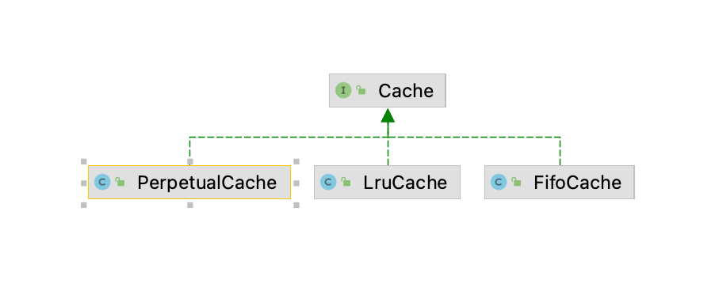
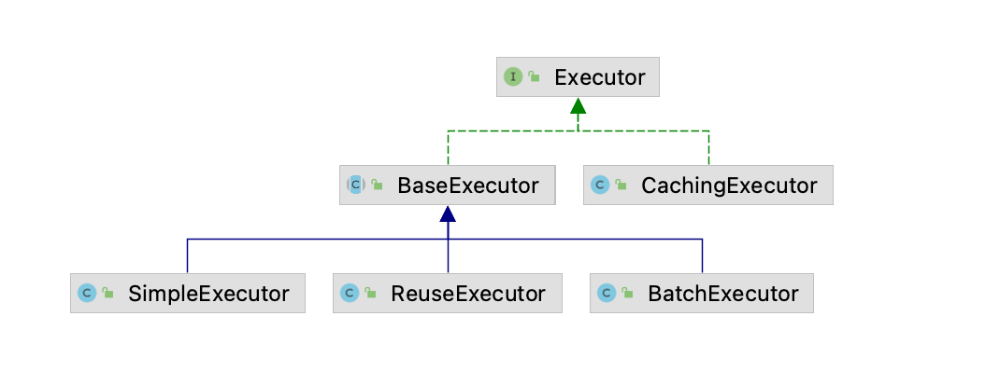
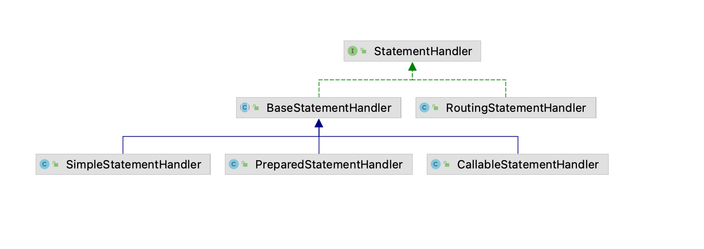

## 引入
```
在上篇文章, 我们对mybatis初始化的代码进行了简单的分析, 了解到了mybatis中配置类的简单结构, 了解了我们定义的
mapper文件中, 一个个的sql标签以MappedStatement的形式存储, 利用mapper文件的namespace和sql标签的id构成key,
MappedStatement构成value, 存储在Configuration中的Map中, MappedStatement中存储了从一个sql执行到将结果集
解析成我们期望的java对象所需要的信息, 将这些信息利用起来正是Mybatis中的执行器对象Executor
```

## 缓存体系分析
```java
在分析执行器代码之前, 我们先来了解一下mybatis中缓存接口体系, 这样我们在后面遇到缓存相关的源码时就不会造成阻碍

在mybatis中定义了缓存接口Cache, 如下:
public interface Cache {
  void putObject(Object key, Object value);

  Object getObject(Object key);

  Object removeObject(Object key);

  void clear();

  int getSize();
}

非常清晰的缓存接口, 放入缓存、获取缓存、移除缓存、清空缓存等等, Cache的继承结构如下图所示, 只有一层结构, 即定义
一个类并实现了Çache接口的功能, 下面这张图我仅仅放出来了部分的实现, 其他也是类似

PerpetualCache里面其实就是利用一个Map对象来完成缓存的功能, LruCache即利用LRU算法实现的缓存, FifoCache即先
进先出形式的缓存, 缓存的实现多种多样, mybatis中默认使用的缓存对象就是PerpetualCache了, 其他类型的我们可以通过
配置来完成, 这边再简单提及一下, mybatis缓存利用的是装饰者模式, 如果对这个模式熟悉的同学应该可以清楚的了解到, 装
饰者模式有增强对象的功能, 即我们可以创建一个缓存拥有多个功能(比如同时拥有LRU、FIFO), 如果对Java流API有所了解的
话, 那么也可以知道InputStream的实现类就是典型的装饰器模式, 如下:
    BufferedInputStream inputStream = new BufferedInputStream( new FileInputStream( "/test" ) );

BufferedInputStream是InputStream类型, FileInputStream也是InputStream类型, BufferedInputStream通过
接收一个InputStream类型的参数, 进而实现缓冲的输入流, mybatis中的Cache模块也是一样的
```



## 源码分析
### Executor接口方法分析
```java
public interface Executor {
  int update(MappedStatement ms, Object parameter) throws SQLException;

  <E> List<E> query(MappedStatement ms, Object parameter, RowBounds rowBounds, ResultHandler resultHandler, CacheKey cacheKey, BoundSql boundSql) throws SQLException;

  <E> List<E> query(MappedStatement ms, Object parameter, RowBounds rowBounds, ResultHandler resultHandler) throws SQLException;

  void commit(boolean required) throws SQLException;

  void rollback(boolean required) throws SQLException;

  CacheKey createCacheKey(MappedStatement ms, Object parameterObject, RowBounds rowBounds, BoundSql boundSql);

  Transaction getTransaction();
}

省略了部分接口方法, 从上面的这些执行sql的方法可以看到, Executor通过MappedStatement对象来完成sql的执行, 同时
提供了sql参数, RowBounds是mybatis提供的内存分页功能, 一般我们开发不会用到(我们通常会通过sql来进行分页, 即sql
利用limit关键字进行分页), BoundSql中保存了动态的sql(比如 select xx from xx where id = #{id}, 里面保存的
是select xx from xx where id = ?  这是在初始化的时候进行解析动态sql得到后的结果, 如果对动态sql的解析有兴趣
的同学可以深入研究下mybatis初始化过程中构建MappedStatement的过程), 之后会利用parameter来填充sql中的问号, 
cacheKey是Executor提供的缓存功能中的key相关对象, 有两种类型的缓存, 之后我们会进行介绍

Executor提供了所有的数据库操作方法(包括存储过程的调用, 省略了), 最基本的增删改查、事务的提交回滚等, 所以说
Executor其实就是利用MappedStatement中保存的信息来完成sql的执行以及结果集的处理, 称为执行器, 我们接下来分析这
一部分的源码
```

### Executor接口继承层次分析
```
如下图所示为Executor的继承体系, BaseExecutor是公共实现, 完成了所有sql执行的公共功能, SimpleExecutor是最通
用的执行器, 封装的是大家熟悉的jdbc代码, 即通过PreparedStatement完成sql的执行, ReuseExecutor跟
SimpleExecutor不同的是, 其缓存了通过sql创建出来的PreparedStatement对象, BatchExecutor提供的是批量操作,
通常情况下, 我们使用的都是SimpleExecutor

在另一边, 可以看到与BaseExecutor处于同一级的CachingExecutor, 这是一个典型的装饰者模式, CachingExecutor提
供了另一层次的缓存(之后我们也会分析, 跟Executor接口中所说的缓存不是一回事, Executor接口本身规定了缓存功能),
除了缓存之外, 所有的数据库操作均是采用委托的形式让其他Executor来完成, 所以CachingExecutor类似于如下的结构:
public class CachingExecutor {
    Executor delegate;

    void query () {
        if (存在缓存) {
            返回缓存
        } else {
            Object result = delegate.query();
            将result写入缓存
        }
    }
}
```



### SimpleExecutor源码分析
##### query方法分析
```java
了解了Executor的继承层次之后, 我们开始分析SimpleExecutor接口的源码, 以BaseExecutor的query方法作为入口进行
分析, 先分析公共部分, BaseExecutor定义了模板, SimpleExecutor则是执行模板中要求子类来实现的功能:

public <E> List<E> query(MappedStatement ms, Object parameter, RowBounds rowBounds, ResultHandler resultHandler) {
    BoundSql boundSql = ms.getBoundSql(parameter);
    CacheKey key = createCacheKey(ms, parameter, rowBounds, boundSql);
    return query(ms, parameter, rowBounds, resultHandler, key, boundSql);
}

public <E> List<E> query(MappedStatement ms, Object parameter, RowBounds rowBounds, ResultHandler resultHandler, CacheKey key, BoundSql boundSql) {
    if (queryStack == 0 && ms.isFlushCacheRequired()) {
        clearLocalCache();
    }
    List<E> list;
    try {
        queryStack++;
        list = resultHandler == null ? (List<E>) localCache.getObject(key) : null;
        if (list != null) {
        handleLocallyCachedOutputParameters(ms, key, parameter, boundSql);
        } else {
        list = queryFromDatabase(ms, parameter, rowBounds, resultHandler, key, boundSql);
        }
    } finally {
        queryStack--;
    }

    return list;
}

BaseExecutor按照Executor的定义, 提供了缓存的功能, 我们来看看第一个query方法, 利用sql以及sql参数调用
createCacheKey方法, 根据一定的规则构建了缓存key, 然后调用了第二个方法, 所以缓存的key我们也可以自定义规则

在第二个方法中, 第一个if判断说明如果不使用缓存(强制刷新缓存), 那么就调用clearLocalCache来清空缓存, queryStack
是查询嵌套次数, 我们在实现结果集映射即定义resultMap时允许嵌套查询, queryStack就是指嵌套查询的层数, 每一次嵌套
查询都会使得queryStack ++, 所以queryStack为0的时候即最开始执行mapper的时候(如果对嵌套查询不熟悉的同学可以跟
着mybatis中文官网的例子写一个嵌套查询, 嵌套查询在我目前的接触中其实用的比较少)

localCache的实现为PerpetualCache, 所以在这一层次的缓存中, 其实就是利用Map完成了缓存功能而已, 如果拿到的list
不为空, 说明存在缓存, 这个时候执行了handleLocallyCachedOutputParameters方法, 否则调用queryFromDatabase
方法从数据库中查询数据, handleLocallyCachedOutputParameters方法我们不用关注, 这个跟存储过程有关, 里面会根
据MappedStatement的类型, 如果是存储过程则执行一定的逻辑, 否则啥也不执行

缓存这一块后面我们会专门拿一篇文章来说明, 这个需要我们深刻的理解SqlSession这个组件才能更好的掌握mybatis中的两层
缓存是如何运转的
```

##### queryFromDatabase方法分析
```java
private <E> List<E> queryFromDatabase(MappedStatement ms, Object parameter, RowBounds rowBounds, ResultHandler resultHandler, CacheKey key, BoundSql boundSql) {
    List<E> list;
    localCache.putObject(key, EXECUTION_PLACEHOLDER);
    try {
        list = doQuery(ms, parameter, rowBounds, resultHandler, boundSql);
    } finally {
        localCache.removeObject(key);
    }
    localCache.putObject(key, list);
    return list;
}

在真正查询数据库之前, 先往缓存中放入一个占位对象, 当从数据库中查询到数据后, 再将占位对象移除, 从而放入真正的缓存
对象, 之所以有这个操作, 跟缓存所在的层次有关, 这个我们先不说, 等到我们揭秘完sqlSession, 真正开始缓存的分析时,
再来解释为啥mybatis为啥在这里会这样做, 这样做能够达到什么效果(小提示, sqlSession是会话的意思, localCache其实
跟sqlSession是绑定的, 会话通常是一对一的, 如果出现了多个人与一个人同时使用一个会话(即多线程操作sqlsession),
需要抛出异常, 即类型转换异常.....通过异常来告诉缓存的操作是非法的, 有点像集合遍历时对集合进行增删改查操作时引发的
并发修改异常)
```

##### StatementHandler体系分析
```java
在分析doQuery之前, 我们先来聊一下StatementHandler这个组件
public interface StatementHandler {
  Statement prepare(Connection connection, Integer transactionTimeout);

  void parameterize(Statement statement);

  void batch(Statement statement);

  int update(Statement statement);

  <E> List<E> query(Statement statement, ResultHandler resultHandler);

  <E> Cursor<E> queryCursor(Statement statement);

  BoundSql getBoundSql();

  ParameterHandler getParameterHandler();
}

在执行doQuery之前, 我们手里有MappedStatement对象还有sql参数parameter, 前者保存了执行一个sql需要的相关信息,
后者是用来替换sql中问号的参数, 回想一下我们开始学习jdbc编程的时候, 有了这些, 我们要创建一个Statement对象, 然后
设置每一个问号的参数, 最后调用其对应的sql方法, 而StatemetHandler正是利用手里已经存在的数据来完成这些jdbc操作的

prepare: 这个方法是用来创建Statement的, 可以创建预编译的PreparedStatement(即对问号进行sql参数替换, 防止
sql注入), 也可以创建执行存储过程的CallableStatement, 还可以创建最普通的Statement(没有防止sql注入的功能)

parameterize: 进行问号替换, 或者说sql预编译, 如果是PreparedStatement, 即调用对应的setxxx方法而已, 如果是
普通的Statement, 就不进行任何操作

batch、update、query、queryCursor就是执行对应的sql功能了

ParameterHandler: 参数处理器, 默认的实现类只做了一个功能, 利用java类型挑选对应的TypeHandler, 然后进行sql参
数的设置, 其实就是完成了之前我们jdbc编程下调用PreparedStatement的setXXX方法而已

经过上面组件的分析, 我们可以联想到, StatementHandler其实就是用来完成jdbc编程的, 通用的流程应该是通过prepare
方法创建Statement, 调用parameterize进行sql参数的映射, sql参数的映射在PreparedStatement情况下就是调用对应
的setXXX方法, 而parameterize完成参数映射其实是利用ParameterHandler完成的, 所以需要用getParameterHandler
方法获取参数处理器, 默认的ParameterHandler即利用java类型挑选对应的TypeHandler, 然后执行不同的setXXX方法,
因为参数处理器只有一个, 而且代码非常简单, 这里就不展开说明, 大家有兴趣可以去看看(利用typehandler完成功能)

分析完接口的功能后, 我们再来看继承体系就清晰多了, 如下图所示, BaseStatementHandler就是实现了上面我们说的这些
操作, 因为这些操作是通用的, 如果是PreparedStatement那么就是完整的上述流程, 如果是普通的Statement, 那么
parameterize方法就是空实现等等

PreparedStatementHandler则是利用PreparedStatement完成sql功能, SimpleStatementHandler则是创建最普通的
Statement完成sql执行, CallableStatementHandler则是存储过程的调用, 非常清晰的三个实现类, 这些handler除了
sql执行外还有对结果集的处理, 后面我们也会清晰的看到

RoutingStatementHandler与BaseStatementHandler处于同一级别, 其完成的是路由的功能, 根据当前的sql类型执行分
别创建上面我们说的三个handler, 然后执行逻辑, 所以mybatis在创建StatementHandler的时候就是创建的
RoutingStatementHandler, 然后通过不同的sql类型真正创建不同的StatementHandler来完成功能

public class RoutingStatementHandler implements StatementHandler {
  private final StatementHandler delegate;

  public RoutingStatementHandler(Executor executor, MappedStatement ms, Object parameter, RowBounds rowBounds, ResultHandler resultHandler, BoundSql boundSql) {
    switch (ms.getStatementType()) {
      case STATEMENT:
        delegate = new SimpleStatementHandler(executor, ms, parameter, rowBounds, resultHandler, boundSql);
        break;
      case PREPARED:
        delegate = new PreparedStatementHandler(executor, ms, parameter, rowBounds, resultHandler, boundSql);
        break;
      case CALLABLE:
        delegate = new CallableStatementHandler(executor, ms, parameter, rowBounds, resultHandler, boundSql);
        break;
    }
  }

  @Override
  public Statement prepare(Connection connection, Integer transactionTimeout) throws SQLException {
    return delegate.prepare(connection, transactionTimeout);
  }
  ..............
}

所以真正的功能操作RoutingStatementHandler啥也没做, 都是交给委派对象完成的
```



##### SimpleExecutor的doQuery方法源码分析
```java
再次回到我们的doQuery方法:
public <E> List<E> doQuery(MappedStatement ms, Object parameter, RowBounds rowBounds, ResultHandler resultHandler, BoundSql boundSql) {
    Statement stmt = null;
    try {
        Configuration configuration = ms.getConfiguration();
        StatementHandler handler = configuration.newStatementHandler(wrapper, ms, parameter, rowBounds, resultHandler, boundSql);
        stmt = prepareStatement(handler, ms.getStatementLog());
        return handler.query(stmt, resultHandler);
    } finally {
        closeStatement(stmt);
    }
}

可以看到, 通过MappedStatement拿到mybatis最顶级的配置对象Configuration, 然后创建StatementHandler, 根据我
们对StatementHandler的分析, 这里其实创建的是RoutingStatementHandler

private Statement prepareStatement(StatementHandler handler, Log statementLog) {
    Statement stmt;
    Connection connection = getConnection(statementLog);
    stmt = handler.prepare(connection, transaction.getTimeout());
    handler.parameterize(stmt);
    return stmt;
}

prepareStatement方法非常简单, 获取Connection, 调用StatementHandler的prepare方法创建Statement, 然后进行
参数化, 如果是PreparedStatement, 则大概完成的操作是:
    PreparedStatement statement = connection.prepareStatement(sql);
    然后利用typehandler调用statement.setString(xxx)这样的方法完成参数的设置

doQuery最后调用了StatementHandler的query方法, 我们以PreparedStatementHandler来进行分析

public <E> List<E> query(Statement statement, ResultHandler resultHandler) throws SQLException {
    PreparedStatement ps = (PreparedStatement) statement;
    ps.execute();
    return resultSetHandler.handleResultSets(ps);
}

非常简单, 就是强转为PreparedStatement, 然后调用execute方法执行sql, 最后将ResultSet映射为java对象
```

##### getConnection方法分析
```java
protected Connection getConnection(Log statementLog) {
    Connection connection = transaction.getConnection();
}

非常简单, 就是利用transaction来完成连接的获取, 我们来看看Transaction:
public interface Transaction {

  Connection getConnection() throws SQLException;

  void commit() throws SQLException;

  void rollback() throws SQLException;

  void close() throws SQLException;

  Integer getTimeout() throws SQLException;
}

Transaction事务接口提供了获取连接、提交事务、回滚事务、关闭连接等等功能, 可以看到, 在这里我们就已经有
transaction对象了, 而这个对象是在创建sqlsession的时候创建的, 在这一部分, 只需要知道我们能拿到对应
的数据库连接就可以了!!至于这个连接怎么在这里可以直接拿到, 我们到sqlsession那一部分再来分析
```

## 总结
```
Executor接口即为执行器, 根据MappedStatement(存储了sql以及结果映射等功能, 即执行一个sql除了参数外的所有东西)
以及参数来完成jdbc操作, 获取返回值, Executor从接口层面规定了需要实现一层缓存, 这一层缓存的默认实现原理即利用一
个Map来完成, Executor需要进行一定的方法调度来完成jdbc操作

BaseExecutor完成了所有子类公共的功能(缓存、嵌套查询等等), SimpleExecutor是我们真正要使用的执行器, 以查询为例
子, 在doQuery方法中完成了功能, 获取StatementHandler, 即获取的是RoutingStatementHandler, 然后利用这个路由
执行器根据sql的类型创建对应的StatementHandler并委托其完成对应的查询功能, 通常情况下是委托
PreparedStatementHandle来完成的, 先是prepare创建Statement, 然后是进行参数映射, 最后调用execute方法完成查
询, 最后进行结果集映射

到此为止, 我们对整个sql执行的流程进行了分析, 其中跳过了结果集如何映射的, 参数如何利用typehandler完成设置的, 这
些东西大家有兴趣可以深入研究下, 对整体有了一定认知后去研究这些会非常轻松, 再次提醒大家, getConnection方法就是
spring整合mybatis中对数据源进行同步的核心功能, 后面我们分析相关代码的时候再来看看如何联动的
```
