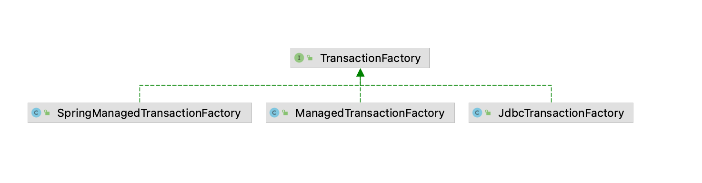
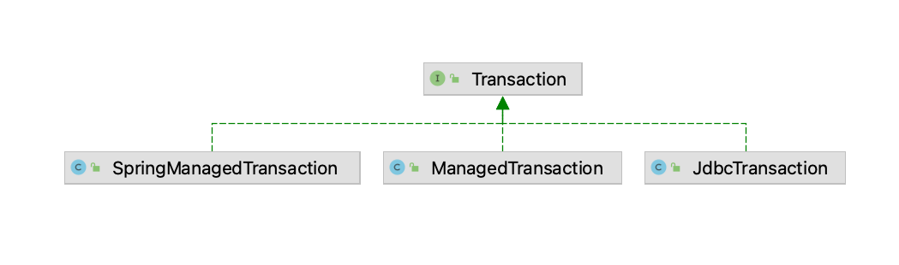

## 引入
```
在上篇文章中, 我们分析了Executor执行器的源码, Executor利用MappedStatement和参数通过一定的调度, 完成了sql参
数的映射、sql的执行、结果集的处理, 即Executor就是将相关组件进行了调度而已

在执行sql之前, 我们分析得到, Executor会利用Transaction对象来获取连接, 然后利用这个连接去执行sql, 本篇文章我
们就来分析下Transaction的功能以及SqlSession这个组件
```

## 事务相关组件分析
### Environment的初始化
```java
在第一篇文章中, 我们对Mybatis的初始化进行了简单的分析, 其中会对Mybatis的配置文件进行分析, 将里面的一个个标签映
射成Java对象, 我们再来看看对<environments>标签的解析源码, 先贴上之前的配置文件:
<configuration>
	<environments default="development">
		<environment id="development">
			<transactionManager type="JDBC"/>
			<dataSource type="POOLED">
				<property name="driver" value="com.mysql.cj.jdbc.Driver"/>
				<property name="url" value="jdbc:mysql://dev1-linux.pospal.cn:3306/pospal?serverTimezone=GMT%2B8&amp;useUnicode=true&amp;characterEncoding=UTF-8&amp;useSSL=true&amp;allowMultiQueries=true"/>
				<property name="username" value="xxx"/>
				<property name="password" value="xxx"/>
			</dataSource>
		</environment>
	</environments>
	<mappers>
		<mapper resource="mapper/CustomerMapper.xml"/>
	</mappers>
</configuration>

可以看到, 我们配置了一个development环境, 在环境中配置了一个datasource数据源, 与此同时, 配置了一个事务管理器
transactionManager, 那么这个是怎么映射到java对象的呢?

private void environmentsElement(XNode context) {
    if (context != null) {
        if (environment == null) {
            environment = context.getStringAttribute("default");
        }
        for (XNode child : context.getChildren()) {
            String id = child.getStringAttribute("id");
            if (isSpecifiedEnvironment(id)) {
                TransactionFactory txFactory = transactionManagerElement(child.evalNode("transactionManager"));
                DataSourceFactory dsFactory = dataSourceElement(child.evalNode("dataSource"));
                DataSource dataSource = dsFactory.getDataSource();
                Environment.Builder environmentBuilder = new Environment.Builder(id)
                    .transactionFactory(txFactory)
                    .dataSource(dataSource);
                configuration.setEnvironment(environmentBuilder.build());
            }
        }
    }
}

transactionManager被映射成了一个TransactionFactory, dataSource被映射成了一个DataSourceFactory, 工厂类
负责生产工厂对象, 最后将TransactionFactory和生产出来的DataSource放到Environment中, 然后将Environment放在
了Configuration配置对象中
```

### TransactionFactory体系分析
```java
解析transactionManager时根据type中的JDBC创建了JdbcTransactionFactory(有兴趣的同学可以看看Configuration
构造方法, 里面有往别名注册器中放入了JDBC与JdbcTransactionFactory的映射), 如下图所示为TransactionFactory
的继承体系, 有三个子类, 其中SpringManagedTransactionFactory是引入了mybatis-spring包后新增的, 而mybatis
其实自带的只有两个: JdbcTransactionFactory、ManagedTransactionFactory

public interface TransactionFactory {
  void setProperties(Properties props);
  Transaction newTransaction(Connection conn);
  Transaction newTransaction(DataSource dataSource, TransactionIsolationLevel level, boolean autoCommit);
}

TransactionFactory接口提供了事务对象的创建, setProperties用于将mybatis的相关属性传入工厂对象中, 如果是自己
实现的工厂对象, 那么就可以接收这个属性对象并且保存下来, 之后在创建事务的时候可以利用这些属性

newTransaction提供了两个重载, 一个是利用Connection连接对象创建事务对象, 一个是根据Datasource数据源创建事务
对象, 所以TransactionFactory其实就是利用传入的数据源 或者 连接对象创建事务对象的, 即事务对象的工厂类

JdbcTransactionFactory是标准的事务工厂类, 应该创建的是标准的事务对象, 即利用连接来对事务进行操作, 
ManagedTransactionFactory是mybatis提供的扩展, 用于将事务交给容器来管理, 根据javadoc的描述: 让容器管理
Transaction的整个生命周期的事务。 延迟连接检索, 直到调用 getConnection(), 忽略所有提交或回滚请求。 默认情况
下, 它关闭连接, 但可以配置为不这样做

而spring整合mybatis则是利用SpringManagedTransactionFactory来完成事务对象的创建
```



### Transaction体系分析
```java
三个事务工厂分别创建不同的事务对象, JdbcTransactionFactory创建JdbcTransaction, 
ManagedTransactionFactory创建ManagedTransaction, SpringManagedTransactionFactory创建
SpringManagedTransaction, 所以Transaction接口也是有三个实现类, 其UML图如下

public interface Transaction {
  Connection getConnection() throws SQLException;

  void commit() throws SQLException;

  void rollback() throws SQLException;

  void close() throws SQLException;

  Integer getTimeout() throws SQLException;
}

事务对象提供了获取连接、提交事务、回滚事务、关闭连接、获取事务超时时间等接口, 子类对这些接口进行实现, 通常实现下
Transaction对象中保存了一个数据源对象Datasource, 然后getConnection方法就是利用Datasource对象创建一个数据
库连接而已, 之后的方法都是对这个连接进行操作了

我们先不说SpringManagedTransaction的作用, 以JdbcTransaction为例子, 其实里面就是调用datasource的
getConnection方法获取连接而已, 是我们熟悉的简单的JDBC操作连接的封装了
```



## SqlSession的创建
```java
public static void main(String[] args) {
    SqlSessionFactory sqlSessionFactory = new SqlSessionFactoryBuilder()
                                .build(Resources.getResourceAsStream( "mybatis-con.xml" ) );
    SqlSession sqlSession = sqlSessionFactory.openSession();
}

public SqlSessionFactory build(InputStream inputStream, String environment, Properties properties) {
    XMLConfigBuilder parser = new XMLConfigBuilder(inputStream, environment, properties);
    return build(parser.parse());
}

public SqlSessionFactory build(Configuration config) {
    return new DefaultSqlSessionFactory(config);
}

我们一开始初始化mybatis的时候, 就是这两行代码, 在build方法中创建了一个xml配置文件解析器XMLConfigBuilder, 而
parse方法就是第一篇文章我们分析的内容了, parse方法返回了一个解析好的Configuration对象, 然后利用这个对象创建了
DefaultSqlSessionFactory

利用DefaultSqlSessionFactory的opensession方法创建了SqlSession, 我们来看看这一段代码:
public SqlSession openSession() {
    return openSessionFromDataSource(configuration.getDefaultExecutorType(), null, false);
}

private SqlSession openSessionFromDataSource(ExecutorType execType, TransactionIsolationLevel level, boolean autoCommit) {
    final Environment environment = configuration.getEnvironment();
    final TransactionFactory transactionFactory = getTransactionFactoryFromEnvironment(environment);
    Transaction tx = transactionFactory.newTransaction(environment.getDataSource(), level, autoCommit);
    final Executor executor = configuration.newExecutor(tx, execType);
    return new DefaultSqlSession(configuration, executor, autoCommit);
}

这个代码我们从下往上看, DefaultSqlSession的创建是利用configuration、executor完成的, 而Executor是用来执行
sql的, 属于mybatis内部运行的组件, 但是Executor在执行sql的时候需要接收MappedStatement对象, 这个对象我们需要
通过namespance + sql标签的id来获取, Executor没法主动获取, 而namespance + sql标签的id则是mybatis开放给框
架使用者对接的入口, 利用namespance + sql标签的id框架使用者能够清晰的知道自己要执行什么sql

所以还需要一个接口层来将框架使用者和mybatis内部的执行器打通, 这个接口就是SqlSession:
List<Object> objectList = sqlSession.selectList("com.fightzhong.mapper.CustomerMapper.selectRemarksById", 1);
public <E> List<E> selectList(String statement, Object parameter) {
    return this.selectList(statement, parameter, RowBounds.DEFAULT);
}

public <E> List<E> selectList(String statement, Object parameter, RowBounds rowBounds) {
    MappedStatement ms = configuration.getMappedStatement(statement);
    return executor.query(ms, wrapCollection(parameter), rowBounds, Executor.NO_RESULT_HANDLER);
}

在之前的文章中, 我们引入了上面的sql, 根据id从customer表查出数据, selectList的第一个参数就是Mapper文件中的
namespace + sql标签中的id构成的, 之前我们也分析了, 每一个sql标签以key、value的形式保存在Map中, key是
namespace + sql标签中的id, value是sql标签的java对象表示形式MappedStatement, 所以SqlSession需要提供对应
的数据库操作接口, 接收一个字符串和sql参数, 内部利用字符串表示的key, 从Map中获取到MappedStatement对象, 进而调
用Executor来执行sql并获取返回值, SqlSession屏蔽了Executor和MappedStatement对象, 对外只暴露了框架使用者关
系的参数

再回到我们上面的代码, 从配置文件中拿到Environment对象(保存了Datasource和TransactionFactory), 从
Environment对象中拿到TransactionFactory, 如果仅仅是在mybatis环境, 则TransactionFactory是
JdbcTransactionFactory, 如果是在spring环境, 则拿到的是SpringManagedTransactionFactory

利用事务工厂类以及数据源对象创建了事务对象Transaction, 然后利用事务对象创建了Executor, 最后利用Executor
创建了DefaultSqlSession, 一个Transaction对象有自己唯一对应的Connection对象, 所以SqlSession跟Connection
对象也是一一对应的, 在web开发中我们也接触过session会话这样的名次, 会话是一对一的, 是单线程的, 所以一个
sqlsession也被期望在单线程中执行, 调用SqlSession的close方法其实就是关闭了数据库连接

总结, SqlSession是会话, 跟一个数据库连接绑定, 期望在单线程中执行, 一次会话会创建一个对应的Executor执行
器, 执行器中有包含了Transaction对象, 对应唯一一个数据库连接, 在执行sql的时候就是利用了这个数据库连接, 同时
SqlSession也是接口层, 用来将框架使用者和mybatis内部进行打通的桥梁, 对外通过暴露给框架使用者通过字符串的形式来
表示执行的对应sql, 对内利用字符串找到对应的MappedStatement对象, 进而利用Executor执行器进行数据库操作
```

## Spring整合Mybatis简单分析
```
spring想要控制mybatis执行sql时的数据库连接, 就需要从Transaction对象入手, 因为在Executor中是利用Transaction
来获取连接并且执行sql的, 所以Spring扩展了事务工厂对象, 利用自己实现的事务工厂对象创建SpringManagedTransaction
对象

在Spring中, 每在一个单线程中执行sql, 都会创建一个SqlSession, 这个SqlSession一般在执行Mapper方法之前创建,
但是, 如果存在事务, 则是在开启事务的时候创建, 创建了SqlSession后, 整个线程执行sql时都会利用这个session完成,
在创建session的时候, spring通过SpringManagedTransaction来管理事务, 管理连接对象, 所以贯穿了
spring-mybatis就是利用SpringManagedTransaction来完成的, 后面我们分析spring事务原理的时候会详细分析这一块,
这里仅仅是对上面提到的SpringManagedTransaction对象进行介绍而已
```

## 总结
```
SqlSession是接口层, 向框架使用者暴露了利用namespace + sql标签的id来执行sql并获取返回值的具体实现, 内部利用
namespace + sql标签的id来获取MappedStatement对象, 然后利用Executor对象来完成sql的执行

与此同时, SqlSession也是一个会话, 与唯一的一个数据库连接绑定, 在spring中, 每次在执行Mapper之前都会创建一个
sqlSession, 与此同时Connection对象也是全新的, 所以一般spring整合数据源Datasource都有连接池的功能, 以此来防
止连接的频繁释放, 在事务的情况下比较特殊, 一个事务需要用一个连接来贯穿所有的sql操作, 所以在事务开启的时候也会创建
一个SqlSession, 后面的数据库操作都用这个session, 而不是重新创建新的, 具体整合的源码我们后面再来分析
```