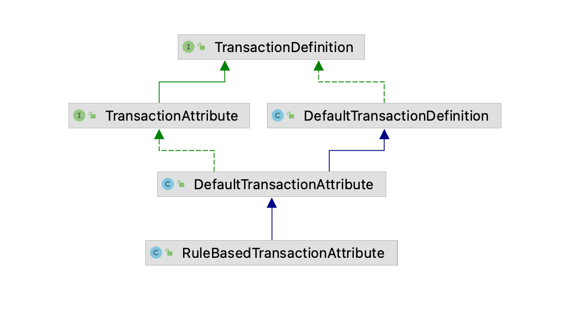
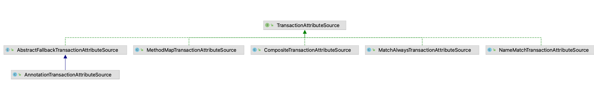

## 一、引入
```
在之前的四篇文章中, 我们已经对Mybatis源码进行了分析, 到此为止, mybatis部分就告一段落了, 现在我们利用两篇文章来
具体的分析下spring事务的原理
```

## 二、Transactional注解的解析及映射
### 2.1、Transactional注解
```java
public @interface Transactional {
	@AliasFor("transactionManager")
	String value() default "";

	@AliasFor("value")
	String transactionManager() default "";

	Propagation propagation() default Propagation.REQUIRED;

	Isolation isolation() default Isolation.DEFAULT;

	int timeout() default TransactionDefinition.TIMEOUT_DEFAULT;

	boolean readOnly() default false;

	Class<? extends Throwable>[] rollbackFor() default {};

	String[] rollbackForClassName() default {};

	Class<? extends Throwable>[] noRollbackFor() default {};

	String[] noRollbackForClassName() default {};

}

在spring中, 我们利用@Transactional注解来开启事务, value / transactionManager两个属性用来表示事务管理器,
我们先不用理会什么是事务管理器, 后面会详细介绍, propagation表示传播行为(属于事务的基础知识, 如果不了解可以百度
学习相关知识及实践), isolation表示事务的隔离级别, 我们通过Connection对象连接mysql的时候, 可以指定这个连接的
事务隔离级别是什么以及timeout事务的超时时间, readOnly表示事务中是否只是可读的, rollbackFor以及
rollbackForClassName表示在哪些异常情况下才会触发事务的回滚, 前者用class对象来标识, 后者用全路径类名, 效果都一
样, noRollbackFor以及noRollbackForClassName表示在哪些异常情况下不进行事务的回滚, 与上一条类似
```

### 2.2、Transactional注解的对象表示形式
```java
Transactional注解中的属性映射成java对象即为下图中的RuleBasedTransactionAttribute对象, 继承体系如下图, 首
先我们来看看TransactionDefinition:

public interface TransactionDefinition {
	int getPropagationBehavior();

	int getIsolationLevel();

	int getTimeout();

	boolean isReadOnly();

	String getName();
}

可以看到, TransactionDefinition接口正好对应着Transactional注解中的传播行为、隔离级别、超时时间、是否只读这
几个功能, getName表示这个事务的名称, 一般用全路径类名 + 方法名构成, 与此同时, TransactionDefinition接口中
还定义了隔离级别以及传播行为的可选常量, 上面代码中并没有贴出来

public interface TransactionAttribute extends TransactionDefinition {
	String getQualifier();

	boolean rollbackOn(Throwable ex);
}

TransactionAttribute在事务定义的基础上增加了相关功能, 称为事务的属性, 其实也很好理解, TransactionDefinition
主要是对一个事务进行了定义, 里面的功能都是跟事务本身的功能有关的, 而TransactionAttribute事务的属性则是一些其他
的功能, getQualifier用于获取的是事务管理器, 对应Transactional注解中value或者transactionManager, 
rollbackOn则用于判断传入的异常是否需要进行回滚, 利用Transactional中那四个跟事务回滚的定义进行判断的

所以, Transactional注解中相关的属性则是利用TransactionDefinition和TransactionAttribute来表示的, 通常情
况下, 我们都是利用TransactionAttribute, 因为其继承于TransactionDefinition, 在面向接口编程的情况下, 我们
利用TransactionAttribute就能获取到Transactional注解的属性等

DefaultTransactionDefinition是TransactionDefinition的默认实现, 里面对接口的方法进行了默认实现, 包括定义
了默认的传播行为是PROPAGATION_REQUIRED等等, DefaultTransactionAttribute则是TransactionAttribute的默认
实现, 里面定义了qualifier和descriptor两个属性, 并且提供的getter和setter方法, 前者我们说过了是事务管理器,
后者是用于描述事务的字符串信息, 再往下, 为了实现Transactional注解中定义的回滚功能, 引入了
RuleBasedTransactionAttribute, 在该对象中, 利用RollbackRuleAttribute来表示回滚相关的配置, 对于
Transactional中的rollbackFor以及rollbackForClassName, 则用RollbackRuleAttribute来表示, 对于
Transactional中的noRollbackFor和noRollbackForClassName, 则用RollbackRuleAttribute的子类
NoRollbackRuleAttribute来表示, 但是RuleBasedTransactionAttribute表示为List<RollbackRuleAttribute>,
而TransactionAttribute中定义的rollbackOn接口在RuleBasedTransactionAttribute中的实现即为利用传入的
Throwable与RollbackRuleAttribute进行一个个比较, 最终确定是否需要回滚
```


### 2.3、Transactional注解的扫描与解析
```java
public interface TransactionAttributeSource {
	TransactionAttribute getTransactionAttribute(Method method, @Nullable Class<?> targetClass);
}

TransactionAttributeSource接口定义了对事务属性的获取功能, getTransactionAttribute利用方法和类对象来获取
相关的事务属性, 如下图所示即为TransactionAttributeSource的继承体系, 可以从多个渠道定义事务属性, 我们利用的是
Transactional注解, 所以在获取事务属性的时候就用的是AnnotationTransactionAttributeSource, 可以简单看看其
源码:
public class AnnotationTransactionAttributeSource extends AbstractFallbackTransactionAttributeSource {
    private final Set<TransactionAnnotationParser> annotationParsers;
    
    protected TransactionAttribute findTransactionAttribute(Class<?> clazz) {
		return determineTransactionAttribute(clazz);
	}

	protected TransactionAttribute findTransactionAttribute(Method method) {
		return determineTransactionAttribute(method);
	}

	protected TransactionAttribute determineTransactionAttribute(AnnotatedElement element) {
		for (TransactionAnnotationParser annotationParser : this.annotationParsers) {
			TransactionAttribute attr = annotationParser.parseTransactionAnnotation(element);
			if (attr != null) {
				return attr;
			}
		}
		return null;
	}
}

可以看到, 其实是利用TransactionAnnotationParser来完成解析的, 传入一个Method对象, 对其进行解析并获得
TransactionAttribute对象, TransactionAnnotationParser有三个, 分别解析不同的注解, 即
Ejb3TransactionAnnotationParser用于解析javax.ejb.TransactionAttribute.class, 
JtaTransactionAnnotationParser用于解析javax.transaction.Transactional.class,
SpringTransactionAnnotationParser用于解析org.springframework.transaction.annotation.Transactional,
而我们使用的正是org.springframework.transaction.annotation.Transactional:

public class SpringTransactionAnnotationParser implements TransactionAnnotationParser{ 
    protected TransactionAttribute parseTransactionAnnotation(AnnotationAttributes attributes) {
		RuleBasedTransactionAttribute rbta = new RuleBasedTransactionAttribute();

		Propagation propagation = attributes.getEnum("propagation");
		rbta.setPropagationBehavior(propagation.value());
		Isolation isolation = attributes.getEnum("isolation");
		rbta.setIsolationLevel(isolation.value());
		rbta.setTimeout(attributes.getNumber("timeout").intValue());
		rbta.setReadOnly(attributes.getBoolean("readOnly"));
		rbta.setQualifier(attributes.getString("value"));

		List<RollbackRuleAttribute> rollbackRules = new ArrayList<>();
		for (Class<?> rbRule : attributes.getClassArray("rollbackFor")) {
			rollbackRules.add(new RollbackRuleAttribute(rbRule));
		}
		for (String rbRule : attributes.getStringArray("rollbackForClassName")) {
			rollbackRules.add(new RollbackRuleAttribute(rbRule));
		}
		for (Class<?> rbRule : attributes.getClassArray("noRollbackFor")) {
			rollbackRules.add(new NoRollbackRuleAttribute(rbRule));
		}
		for (String rbRule : attributes.getStringArray("noRollbackForClassName")) {
			rollbackRules.add(new NoRollbackRuleAttribute(rbRule));
		}
		rbta.setRollbackRules(rollbackRules);

		return rbta;
	}
}

非常清晰的代码, 将传入的AnnotationAttributes对象进行解析为RuleBasedTransactionAttribute并返回, 再回到本
小结开头引入的TransactionAttributeSource中来, 我们现在知道了AnnotationTransactionAttributeSource是用来
实现从一个Method中获取事务相关属性功能的, 即用来获取TransactionAttribute的, 其实里面是利用一个个的parser解析
器来完成的, 其还有一个父类AbstractFallbackTransactionAttributeSource, 该父类提供了缓存的功能, 对于一个
方法解析Transactional注解的信息需要保存下来, 多次触发该方法调用的时候, 只需要从缓存中取就好了
```


### 2.4、总结
```
Transactional注解映射成java对象即为TransactionAttribute接口, 其实现为RuleBasedTransactionAttribute,
从一个方法中获取Transtional注解相关信息, 即获取TransactionAttribute, 是利用
AnnotationTransactionAttributeSource对象, AbstractFallbackTransactionAttributeSource是该对象的父类,
提供了缓存的功能, AnnotationTransactionAttributeSource通过不同的解析器来完成对不同的Transactional注解的
解析, 其中spring中的Transactional注解则是利用SpringTransactionAnnotationParser来完成的
```

## 三、事务执行流程中涉及的组件
### 3.1、事务对象
```java
public abstract class JdbcTransactionObjectSupport implements SmartTransactionObject {
    private ConnectionHolder connectionHolder;

    public ConnectionHolder getConnectionHolder(){}

    public void setConnectionHolder(ConnectionHolder connectionHolder) {}

    public Object createSavepoint(){}

    public void rollbackToSavepoint(Object savepoint){}

    public void releaseSavepoint(Object savepoint){}
}

事务对象在spring中提供了JdbcTransactionObjectSupport和JtaTransactionObject, 对于日常的开发来说, 我们都
是使用JdbcTransactionObjectSupport来表示事务对象的, 事务对象表示的是当前启动的这个事务本身, 不同的连接拥有不
同的事务对象, 每开启一个事务都会创建一个事务对象

事务对象中保存了一个ConnectionHolder, ConnectionHolder即连接的保存者, 里面持有当前事务的连接, 
JdbcTransactionObjectSupport事务对象提供的功能就是获取连接、创建回滚点、将事务回滚到特定的回滚点, 释放回滚点
等等操作, 可以看到, 即提供了一系列的事务功能, 回滚点大家有熟悉mysql的话, 可以了解到, 在事务执行的过程中, 可以设
置多个回滚点, 如果出现了特殊情况, 我们可以手动操作事务回滚到特定的回滚点, 而不是整个事务都进行回滚

JdbcTransactionObjectSupport的直接子类为DataSourceTransactionObject, 该子类增加了两个标识位, 
newConnectionHolder表示是否是一个新的连接、mustRestoreAutoCommit表示是否一定要重置autocommit标识, 如果为
true, 则connection.setAutoCommit(true),  这两个标识位我们可以先不用太了解其具体使用场景, 只需要知道的是,
DataSourceTransactionObject用于表示一个事务对象, 同时提供了回滚点的功能, 在所有的事务操作中, 都需要获取到这
个事务对象才能拿到连接并进行操作
```

### 3.2、事务状态
```java
有了事务对象提供连接以及回滚点后, 我们在事务执行的过程中可能需要获取当前事务相关的状态信息, 这个就是利用
TransactionStatus来表示的:
public interface TransactionStatus extends SavepointManager, Flushable {
	boolean isNewTransaction();

	boolean hasSavepoint();

	void setRollbackOnly();

	boolean isRollbackOnly();

	boolean isCompleted();
}

提供了判断是否是新的事务、是否存在回滚点、事务是否必须要回滚、事务是否已经执行完成等功能, 这些功能都是跟事务当前的
状态有关的

AbstractTransactionStatus则是对TransactionStatus中的接口进行了基本实现, 里面提供了回滚点相关的功能, 包括
创建回滚点、释放回滚点, 即事务状态的公共操作类, 但是执行这些操作是由事务对象来完成的, 所以抽象类中提供的这些方法
都需要子类来完成, 因为不同的事务对象其操作也是不一样的, 像上面我们提到的JdbcTransactionObjectSupport即为jdbc
事务对象提供的相关功能, 所以子类要规定事务对象是什么, 父类通过子类提供的事务对象来完成对应的方法操作

public abstract class AbstractTransactionStatus implements TransactionStatus {
    .....实现TransactionStatus接口中的方法.....

    public void createAndHoldSavepoint() {创建回滚点并且保存回滚点, 利用子类提供的事务对象来创建}

    public void rollbackToHeldSavepoint(){回滚到回滚点}

    public void releaseHeldSavepoint(){释放回滚点}
}

public class DefaultTransactionStatus extends AbstractTransactionStatus {
    private final Object transaction;

    private final Object suspendedResources;

    public Object getTransaction() {
		return this.transaction;
	}
}

DefaultTransactionStatus中的transaction正是我们上面提到的DataSourceTransactionObject, 即
JdbcTransactionObjectSupport, 所以事务状态中持有一个事务对象, 进而提供查询事务当前状态以及相关回滚点操作
```

## 4、总结
```
@Transactional注解在java中利用TransactionAttribute接口实现类来表示, 利用RuleBasedTransactionAttribute
来完成根据指定异常回滚的功能

TransactionAttributeSource接口定义了事务扫描的操作, AnnotationTransactionAttributeSource是基于注解实现
的事务扫描, 其里面内置了一个解析器SpringTransactionAnnotationParser来完成@Transactional注解的扫描, 扫描
完成后, 构建了RuleBasedTransactionAttribute对象并返回, AnnotationTransactionAttributeSource的父类
AbstractFallbackTransactionAttributeSource提供了注解信息对象的缓存功能, 多次调用同一个方法的时候, 如果开启
了事务, 可以从缓存中拿到对应的事务信息

每开启一个事务就会创建一个事务对象, 该事务对象的生命周期即为当前事务, 事务对象维护了事务对应的数据库连接对象, 在
我们日常使用中, 利用的是DataSourceTransactionObject来表示事务对象的, 其父类为
JdbcTransactionObjectSupport, 与此同时, 事务执行的过程中, 会有状态的扭转, 利用TransactionStatus接口来提
供事务状态的获取, DefaultTransactionStatus是其默认实现, 里面维护了一个Object类型的transaction属性, 这个属
性在通常情况下则为DataSourceTransactionObject事务对象
```