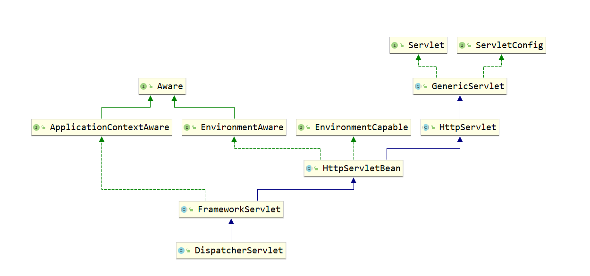

### 引入
```
本文主要是分析SpringMVC中DispatchServlet的初始化流程, 从Servlet的init方法调用开始, 到
WebApplicationCotext创建结束即本文的主要内容, 在web容器被初始化完成后, 就会开始初始化SpringMVC的九大
组件, 之后的文章便是对这九大组件的初始化进行分析,本文的最后, 在Web容器初始化完成后, 会引出SpringMVC是如
何开启九大组件的初始化过程的, 为了能够更好的理解, 笔者在之前已经分析了Spring监听器的源码, 有兴趣的话可以
先去看看哈
```

> 注意: 笔者分析源码时, 对于一些没有意义的代码都不会贴出来, 比如日志的打印以及try...catch

### 先来看看BeanWrapper的作用
```java
public class User {
    private String name;
    
    .......getter/setter......
}

public static void main(String[] args) {
    User user = new User();
    BeanWrapper beanWrapper = new BeanWrapperImpl( user );
    System.out.println( user.getName() );
    beanWrapper.setPropertyValue( "name", "张三" );
    System.out.println( user.getName() );
}

分析:
    如果看过笔者之前分析Spring源码的同学可能就会清晰的了解到, Spring在创建完一个Bean对象的时候, 即在推
    断构造方法被调用完成之后, 会将创建好的bean实例用BeanWrapper这个类封装起来, 其实很简单, 就是
    new BeanWrapperImpl(bean), 这个类是Spring用来操作一个bean对象属性的工具, 使用它可以直接修改一个
    对象的属性

    如上面的main方法的代码, 执行后会有两行输出, 一行是null, 一行是"张三", 由此可见, 通过将一个对象包装
    成一个BeanWrapper后, 就能通过setPropertyValue来直接设置对象属性, 其底层就是利用反射来操作set方法
    而已
```

### DispatcherServlet的继承体系结构
```
整个DispatcherServlet的继承体系如下图所示, 先来看看右边一块关于HttpServlet的继承体系, 在上篇文章中,笔
者深入的分析了整个HttpServlet的继承体系, 对每一个类主要完成的功能进行了详细的分析, 这里简单的回顾一下,
Servlet作为其顶层接口, 其直接实现类为GenericServlet, 在该类中, 主要是为了将init(ServletConfig config)
方法在被Tomcat等容器调用时传入的ServletConfig对象给保存下来, 并且提供了空参的init重载方法供子类完成初
始化工作, 与此同时, 该类实现了ServletConfig接口, 利用保存下来的ServletConfig属性对这些接口的实现进行
了填充, GenericServlet的直接子类HttpServlet, 主要是对父类的service方法进行了实现, 对不同类型的请求进
行判断, 调用不同的doXXX方法, 从而我们可以直接实现HttpServlet来配置我们请求被执行的逻辑

再来看看左半部分的内容, 在左半部分中, 主要的继承关系是HttpServletBean <#### FrameworkServlet 
<#### DispatcherServlet, 而其他接口都是Spring中提供的扩展点, 实现XXXAware接口, 那么在Spring容器初始化过
程中, 合适的时机就会调用该对象的setXX方法, 如果有看过笔者之前分析Spring文章的同学应该就可以清晰的知道,
在initializeBean方法就是完成这些功能的

所以主要的核心就是HttpServletBean、FrameworkServlet、DispatcherServlet三个类了, 接下来我们就会开始
分析这三个类完成的功能
```



### HttpServletBean
#### init方法触发Servlet的生命周期
```java
回顾了下原来的Servlet继承体系, 我们得到一个重要的消息, 子类继承HttpServlet, 实现空参init方法, 则该方
法在Tomcat等web容器初始化Servlet的时候会调用该init方法, 于是我们可以联想到, 好像仅仅只有这个方式才能让
程序主动的执行我们提前写好的代码了

public final void init() throws ServletException {
    PropertyValues pvs = new ServletConfigPropertyValues(getServletConfig(), this.requiredProperties);
    if (!pvs.isEmpty()) {
        BeanWrapper bw = PropertyAccessorFactory.forBeanPropertyAccess(this);
        ResourceLoader resourceLoader = new ServletContextResourceLoader(getServletContext());
        bw.registerCustomEditor(Resource.class, new ResourceEditor(resourceLoader, getEnvironment()));
        initBeanWrapper(bw);
        bw.setPropertyValues(pvs, true);
    }

    initServletBean();
}

分析:
    首先我们可以看到, init方法一开始就创建了一个ServletConfigPropertyValues类, 参数是ServletConfig,
    大家现在应该很清楚这个里面是一定能获得ServletConfig的吧, 至于ServletConfig在哪里以及怎么放进去的
    之前已经说的很详细了

    可以看到ServletConfigPropertyValues是PropertyValues子类, 我们先不用管这个new的过程做了什么事情,
    主要明白一个事情,PropertyValues保存了key-value, 即属性名-属性值, 接着往下看：
        PropertyAccessorFactory.forBeanPropertyAccess(this)
    this指的是当前的DispatcherSerlvet本身, 因为HttpServletBean是一个抽象类, 在DispatcherServlet被创
    建时会调用到init方法, 这段代码里面很简单, 就是return new BeanWrapperImpl(target)

    到现在,相信大家应该会很清楚了,将DispatcherServlet对象封装成一个BeanWrapper,从而能够直接操作其属性

    initBeanWrapper是一个空方法, 子类没有对其进行任何的处理, 通过bw.setPropertyValues(pvs, true);
    我们可以联想到, 一定是往DispatcherServlet中设置了属性的值, 那么到底设置了什么呢?这就要看
    PropertyValues中保存了什么了
```

#### ServletConfigPropertyValues的构造方法的调用
```java
private static class ServletConfigPropertyValues extends MutablePropertyValues {}

public ServletConfigPropertyValues(ServletConfig config, Set<String> requiredProperties) {

    Set<String> missingProps = (!CollectionUtils.isEmpty(requiredProperties) ?
            new HashSet<>(requiredProperties) : null);

    Enumeration<String> paramNames = config.getInitParameterNames();
    while (paramNames.hasMoreElements()) {
        String property = paramNames.nextElement();
        Object value = config.getInitParameter(property);
        addPropertyValue(new PropertyValue(property, value));
        if (missingProps != null) {
            missingProps.remove(property);
        }
    }

    // Fail if we are still missing properties.
    if (!CollectionUtils.isEmpty(missingProps)) {
        ....抛出异常.....
    }
}

分析:
    首先我们先不管第二个参数requiredProperties, 仅仅看SerlvetConfig做了什么事情, 获取所有的
    initParameterNames, 遍历一个个的paramNames, 取得其value, 将其封装成一个PropertyValue, 放入到
    MutablePropertyValues中的集合中

    在web.xml中配置DispatcherServlet的时候, 我们是可以指定initParam参数的, 如下:
        <servlet>
            <servlet-name>dispatchServlet</servlet-name>
            <servlet-class>org.springframework.web.servlet.DispatcherServlet</servlet-class>
            <init-param>
                <param-name>contextConfigLocation</param-name>
                <param-value>classpath:spring-mvc.xml</param-value>
            </init-param>
        </servlet>
    所以这个new方法做的事情就很清晰了, 获取ServletConfig中的所有init-param, 将其封装成PropertyValue,
    在之后调用BeanWrapper的setPropertyValue的时候, 将其设置到DispatcherServlet中, 所以说其实就是将
    contextConfigLocation的值设置到了DispatcherServlet中

    而这个requiredProperties的作用也很简单, 表示必须要设置哪些属性, 或者说, Servlet在配置的时候必须提
    供哪些初始化参数
```

#### 总结
```
HttpServletBean这个类实现了HttpServlet, 实现了init空参方法, 在空参方法中, 将ServletConfig中配置的
initParam值设置到DispatcherServlet中的属性中(也有可能在父类), 然后调用了initServletBean模板方法就结
束了, 这个方法将会由子类实现
```

### FrameworkServlet
#### initServletBean
```java
protected final void initServletBean() throws ServletException {
    this.webApplicationContext = initWebApplicationContext();
    initFrameworkServlet();
}

分析: 
    initServletBean的代码就两行, 一行是初始化Web版本的Spring容器, 一行是调用initFrameworkServlet方
    法, 该方法是一个空方法, 子类可以通过实现该方法进行一定的操作, 所以核心就是
    initWebApplicationContext, 将初始化完成的web容器设置到this.webApplicationContext, 即
    DispatcherServlet会持有一个指向web容器的引用
```

#### initWebApplicationContext初始化Web容器-第一部分
```java
protected WebApplicationContext initWebApplicationContext() {
    WebApplicationContext rootContext =
            WebApplicationContextUtils.getWebApplicationContext(getServletContext());

    ..................................
}

分析:
    首先我们来看看initWebApplicationContext方法的第一部分, getServletContext方法获取ServletContext,
    在之前分析Servlet继承体系的时候, 笔者也深入分析了Servlet上下文的获取方式, 这里就不再讲解

    获取到Servlet上下文后, 调用getWebApplicationContext先获取一次web容器, 根据变量名可以看到, 叫做根
    容器, 于是我们可以联想联想到, Spring好像是可以设置父子容器的, 那么这个rootContext可能就会被作为我
    们web容器的父容器吗?

public static WebApplicationContext getWebApplicationContext(ServletContext sc) {
    return getWebApplicationContext(sc, WebApplicationContext.ROOT_WEB_APPLICATION_CONTEXT_ATTRIBUTE);
}   

WebApplicationContext.ROOT_WEB_APPLICATION_CONTEXT_ATTRIBUTE = WebApplicationContext.class.getName() + ".ROOT";

public static WebApplicationContext getWebApplicationContext(ServletContext sc, String attrName) {
    Object attr = sc.getAttribute(attrName);
    if (attr == null) {
        return null;
    }
    return (WebApplicationContext) attr;
}

分析:
    可以清晰的看到, 其实getWebApplicationContext方法很简单, 就是从Servlet上下文中获取key为
    WebApplicationContext.ROOT的值而已, 也就是说, 我们可以通过Servlet上下文ServletContext的
    setAttribute方法设置一个根容器, 很显然, 从之前的代码分析中, 此时attr为null, 所以这个方法返回的
    是null        
```

#### initWebApplicationContext初始化Web容器-第二部分
```java
protected WebApplicationContext initWebApplicationContext() { 
    ...................

    WebApplicationContext wac = null;

    if (this.webApplicationContext != null) {
        wac = this.webApplicationContext;
        if (wac instanceof ConfigurableWebApplicationContext) {
            ConfigurableWebApplicationContext cwac = (ConfigurableWebApplicationContext) wac;
            if (!cwac.isActive()) {
                if (cwac.getParent() == null) {
                    cwac.setParent(rootContext);
                }
                configureAndRefreshWebApplicationContext(cwac);
            }
        }
    }

    ...................
}

分析:
    this.webApplicationContext不为空并且其parent为null的时候, 那么会将this.webApplicationContext设
    置父容器为上面我们获取到的值, 通常情况下为null, 然后调用configureAndRefreshWebApplicationContext
    方法开始刷新容器

    我们首先联想一下什么时候this.webApplicationContext不为null, 可以看看FrameWorkServlet的构造方法,
    发现可以传入一个WebApplicationContext参数, 这个参数的值就被设置到了this.webApplicationContext, 
    我们仔细想想, 好像这个构造方法我们也没机会调用啊, 那是因为采用了xml的配置方式来完成DispatcherServlet
    的初始化而已啊, 如果对无xml完成SpringMVC环境搭建有所了解的话, 就会知道, 在通过无XML配置的时候, 我
    们会手动创建DispatcherServlet, 并且传入一个Spring上下文, 如:
       AnnotationConfigWebApplicationContext context = new AnnotationConfigWebApplicationContext();
       context.register(SpringConfig.class);
       DispatcherServlet dispatcherServlet = new DispatcherServlet( context );
    这里笔者先不会去讲解如何实现无xml配置, 仅仅是为了通过这个引出什么时候this.webApplicationContext不
    为空而已, 在整个SpringMVC的源码分析的最后, 笔者会写一篇如何实现无xml完成SpringMVC环境搭建的文章, 
    并且是无web.xml的吼,可以期待下哈

    所以通常情况下this.webApplicationContext是为null的
```

#### initWebApplicationContext初始化Web容器-第三部分
```java
protected WebApplicationContext initWebApplicationContext() { 
    ...................

    if (wac == null) {
        wac = findWebApplicationContext();
    }
    if (wac == null) {
        wac = createWebApplicationContext(rootContext);
    }

    if (!this.refreshEventReceived) {
        onRefresh(wac);
    }

    if (this.publishContext) {
        String attrName = getServletContextAttributeName();
        getServletContext().setAttribute(attrName, wac);
    }

    return wac;
}

分析:
    通过上面的流程, 我们已经知道了, wac是null的, 因为此时我们是采用xml的配置方式, 于是就会进入第一个对
    wac为null的判断

protected WebApplicationContext findWebApplicationContext() {
    String attrName = getContextAttribute();
    if (attrName == null) {
        return null;
    }
    WebApplicationContext wac =
            WebApplicationContextUtils.getWebApplicationContext(getServletContext(), attrName);
    if (wac == null) {
        throw new IllegalStateException("No WebApplicationContext found: initializer not registered?");
    }
    return wac;
}

分析:
    很简单, 就是获取ServletContext即Servlet上下文中的key为"WebApplicationContext..ROOT"的值嘛, 跟获
    取rootContext是一模一样的, 因为此时还没找到web容器, 就先看看Servlet上下文中存不存在程序员主动设置
    的, 如果存在, 就直接用就好了, 如果不存在, 那么就进入到了第二次wac == null的判断

    即调用createWebApplicationContext方法创建一个web上下文, 通常情况下我们的web上下文就是通过这个方式
    创建的

    再来看看最后两个判断：
        if (!this.refreshEventReceived) {
            onRefresh(wac);
        }

        if (this.publishContext) {
            String attrName = getServletContextAttributeName();
            getServletContext().setAttribute(attrName, wac);
        }
    
    很简单, 如果this.refreshEventReceived为false, 则调用onRefresh方法, 此时调用一次, 如果
    this.publishContext为true则将当前的web容器设置到Servlet上下文中, 就像我们之前从Servlet上下文中获
    取web容器一样, 通常情况下这个值为true, 接下来我们来说说, this.refreshEventReceived默认为false, 
    什么时候this.refreshEventReceived为true呢?

小小的总结:
    首先经过对这个initWebApplicationContext的判断, 我们知道, web容器有三个来源, 一个是通过构造方法传
    进DispatcherServlet,通常用于无xml配置SpringMVC环境, 一个是设置在ServletContext中的, 还有一个是
    主动创建的, 第一种和第三种都会调用configureAndRefreshWebApplicationContext方法, 在该方法中, 就将
    这个this.refreshEventReceived设置为了true, 之后我们也能通过代码看到, 而通过从ServletContext中获
    取的就没有这个操作, 所以这个值仍然为false, 所以会进入判断, 从而调用onRefresh方法, 这个方法里面就完
    成了SpringMVC的九大组件的初始化, 相应的, 在configureAndRefreshWebApplicationContext方法中, 设置
    了this.refreshEventReceived为true后, 也会调用onRefresh方法, 正是因为这个时候调用了, 所以才要设置
    this.refreshEventReceived为true, 防止多次调用
```

#### createWebApplicationContext方法创建web容器
```java
protected WebApplicationContext createWebApplicationContext(@Nullable ApplicationContext parent) {
    Class<?> contextClass = getContextClass();
    if (!ConfigurableWebApplicationContext.class.isAssignableFrom(contextClass)) {
        throw new ApplicationContextException();
    }
    ConfigurableWebApplicationContext wac =
            (ConfigurableWebApplicationContext) BeanUtils.instantiateClass(contextClass);

    wac.setEnvironment(getEnvironment());
    wac.setParent(parent);
    String configLocation = getContextConfigLocation();
    if (configLocation != null) {
        wac.setConfigLocation(configLocation);
    }
    configureAndRefreshWebApplicationContext(wac);

    return wac;
}

分析:
    getContextClass方法获取到FrameWorkServlet中的contextClass属性值, 这个属性值表示了需要创建的web
    容器类型, 默认值是XmlWebApplicationContext.class, 但是我们可以通过在web.xml中配置init-param初始
    化参数, key为contextClass, value为我们期望创建的web容器, 而在HttpServletBean中就会将这个值设置
    到contextClass属性中

    如果我们设置的contextClass不是ConfigurableWebApplicationContext类型的, 就会抛出一个异常, 否则通
    过BeanUtils工具类以反射的方式创建web容器, 与此同时设置Environment, 父容器, 并且将init-param中的
    contextConfigLocation的值(在HttpServletBean中已经将这个值设置到了DispatcherServlet中)设置到容器
    中, 因为之后容器会解析这个xml, 从而获取里面的bean等, 之后边便调用了
    configureAndRefreshWebApplicationContext方法
```

#### configureAndRefreshWebApplicationContext方法完成容器的刷新动作
```java
protected void configureAndRefreshWebApplicationContext(ConfigurableWebApplicationContext wac) {
    wac.setServletContext(getServletContext());
    wac.setServletConfig(getServletConfig());
    wac.setNamespace(getNamespace());
    wac.addApplicationListener(new SourceFilteringListener(wac, new ContextRefreshListener()));

    ConfigurableEnvironment env = wac.getEnvironment();
    if (env instanceof ConfigurableWebEnvironment) {
        ((ConfigurableWebEnvironment) env).initPropertySources(getServletContext(), getServletConfig());
    }

    postProcessWebApplicationContext(wac);
    applyInitializers(wac);
    wac.refresh();
}

分析:
    前四行, 往容器中主动的设置了Servlet上下文, ServletConfig, Namespace, 以及一个
    SourceFilteringListener监听器, 这个监听器是核心, 之后我们会重点讲解其作用, 与此同时, 取出容器中的
    Environment, 传入Servlet上下文和ServletConfig, 作用就是在环境中保存这两个值而已

    postProcessWebApplicationContext方法是一个空方法, 提供给程序员扩展使用的, applyInitializers方法
    笔者不太清楚其作用, 这里不进行展开, 并且这个貌似很少用到.....

    ok, 又见到了我们熟悉的refresh方法了, 在笔者的Spring源码分析文章中, 已经对该方法进行了详细讲解, 该
    方法就是完成Spring容器的初始化流程的, 这里就不进行展开了
```

#### SourceFilteringListener监听器
```java
private class ContextRefreshListener implements ApplicationListener<ContextRefreshedEvent> {
    @Override
    public void onApplicationEvent(ContextRefreshedEvent event) {
        FrameworkServlet.this.onApplicationEvent(event);
    }
}

public SourceFilteringListener(Object source, ApplicationListener<?> delegate) {
    this.source = source;
    this.delegate = (delegate instanceof GenericApplicationListener ?
            (GenericApplicationListener) delegate : new GenericApplicationListenerAdapter(delegate));
}

分析:
    查看ContextRefreshListener和SourceFilteringListener, 核心便是ContextRefreshListener, 可以看到
    该监听器是对ContextRefreshedEvent事件感兴趣的, 结合之前笔者对监听器源码分析的文章, 可以很容易的想
    到, 在refresh方法的最后, Spring就是主动的触发了这个事件, 这里用SourceFilteringListener包了一层,
    作用很简单, 期望在监听器中增加一个source属性, 将web容器保存下来而已, 这个就是一个典型的装饰者模式
    了!!!! 

    当调用SourceFilteringListener的onApplicationEvent方法的时候, 就会委派给ContextRefreshListener,
    从而调用的是ContextRefreshListener的onApplicationEvent方法, 如下:
        public void onApplicationEvent(ApplicationEvent event) {
            if (event.getSource() == this.source) {
                onApplicationEventInternal(event);
            }
        }

        protected void onApplicationEventInternal(ApplicationEvent event) {
            this.delegate.onApplicationEvent(event);
        }

    接下来我们看看ContextRefreshListener.onApplicationEvent方法的做的事情!!!

    public void onApplicationEvent(ContextRefreshedEvent event) {
        this.refreshEventReceived = true;
        onRefresh(event.getApplicationContext());
    }

    大家是不是觉得突然清晰了, 先将this.refreshEventReceived设置为了true, 然后调用onRefresh方法, 设置
    为了true后就可以防止多次调用了!!!而onRefresh方法就完成了九大组件的初始化
```

### 总结
```
HttpServletBean的功能: 将ServletConfig中配置的初始化参数设置到DispatcherServlet中
FrameworkServlet的功能: 完成容器的初始化, 容器可以有三种方式获取, 通过构造方法传入(用于无xml实现Spring
                        MVC配置), 通过在Servlet上下文中设置attribute, 手动创建, 通常情况下是手动创建
                        容器, 在容器调用refresh方法的时候, 会触发ContextRefreshedEvent事件, 从而触
                        发ContextRefreshListener的onApplicationEvent方法的调用, 从而调用
                        DispatcherServlet的onRefresh方法
DispatcherServlet的功能: 完成九大组件的初始化
```
