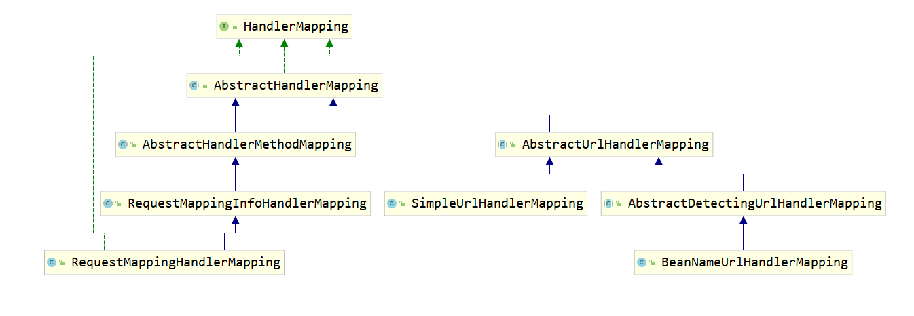
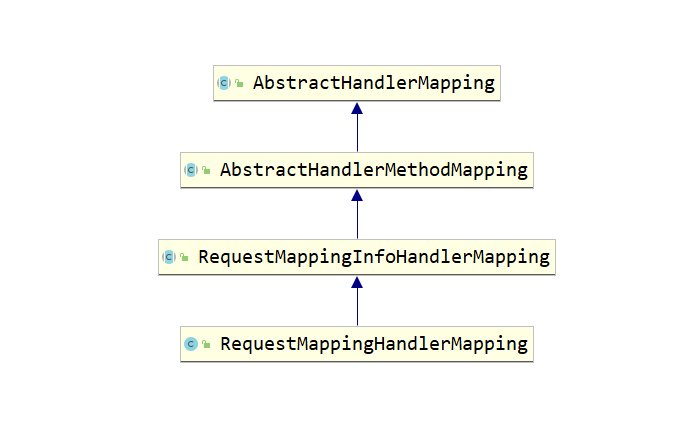

### 引入-SpringMVC的执行流程简单分析
```java
经过上一篇文章DispatcherServlet初始化流程的分析, 笔者带领大家完整的看到的DispatcherServlet初始化过程
以及web容器的初始化过程, 在web容器利用Servlet的生命周期初始化完成后, 触发了ContextRefreshedEvent事件,
与此同时, 触发了web容器初始化过程中添加进去的ContextRefreshListener监听器, 在该监听器中调用了
FrameworkServlet的onApplicationEvent方法, 进而调到了onRefresh方法, onRefresh方法又调用了
initStrategies方法, 在该方法中完成了SpringMVC九大组件的初始化过程:
protected void initStrategies(ApplicationContext context) {
    initMultipartResolver(context);
    initLocaleResolver(context);
    initThemeResolver(context);
    initHandlerMappings(context);
    initHandlerAdapters(context);
    initHandlerExceptionResolvers(context);
    initRequestToViewNameTranslator(context);
    initViewResolvers(context);
    initFlashMapManager(context);
}

本文的主要目的是完整的分析HandlerMapping这个组件的源码, 在分析HandlerMapping源码之前, 笔者先带领大家回
顾一下SpringMVC的执行流程, 相信大家学SpringMVC必然是不会错过这一块内容的, SpringMVC的执行流程中, 主要
涉及到了以下几个类或者概念: HandlerMapping、Handler、HandlerAdapter、ModelAndView、ViewResolver、
HandlerInterceptor

当我们的请求到达SpringMVC的时候, 必然是触发了Servlet的service方法, 此时暂时不去讨论DispatcherServlet、
是如何详细的处理请求的, 在组件分析完成后, 我们会统一分析SpringMVC的执行流程, 触发了service方法后, 可以
根据HttpServletRequest来获取url, 而此时, 这个url到底映射到哪个类或者说哪个类的哪个方法呢?这个就是由
HandlerMapping来决定的, 比如有如下配置:
    <bean id="simpleUrlHandlerMapping" 
                class="org.springframework.web.servlet.handler.SimpleUrlHandlerMapping">
        <property name="urlMap">
            <props>
                <prop key="/hello">com.test.controller.MyHandler</prop>
            </props>
        </property>
    </bean>

    public class MyHandler implements Controller {
        @Override
        public ModelAndView handleRequest(HttpServletRequest request, 
                                    HttpServletResponse response) throws Exception {
            return new ModelAndView( "hello.jsp" );
        }
    }

那么在HandlerMapping中必然就会存在一个由/hello这个url到MyHandler这个类的映射, 或者以目前开发中用的最
流行的配置方式:
    @RequestMapping( value = "/test1" )
    public String test2() {
        return "hello.jsp";
    }

同样的, 在HandlerMapping中也会存在一个/test1这个url到test2这个方法的映射

在上面的代码中, 我们就可以称MyHandler这个类以及test2这个方法为一个Handler, 即处理请求的东西, 这时大家
可以看, HandlerMapping虽然帮我们维护了这些url的映射关系, 但是Handler的类型竟然是多样性的, 可以是类, 可
以是方法等, 那么即使找到这个Handler, 又怎么知道如何才能执行处理请求的逻辑呢?毕竟一个类可能有多个方法, 执
行哪个也是没法确定的

于是, HandlerAdapter就出场了, 顾名思义, 处理器适配器, 熟悉适配器模式的同学应该会很清楚, 适配器模式, 将
不同的接口适配成同一个接口, 比如经典场景-电源适配器, 好了, 我们不去深究适配器模式, 处理器适配器就是帮助
我们来完成如何调用处理器的, 如果当前处理器是一个方法, 那就通过反射直接调用了, 如果当前处理器是一个类, 那
么就转成接口, 调用该类实现的接口方法, 不同的适配器完成的功能是不一样的, 之后我们也会详细分析这个源码, 记
住, HandlerAdapter的作用是实现不同处理器的调用

调用结束, 返回一个ModelAndView, 即视图, 但是还能返回字符串, 比如"hello.jsp", 如何将字符串转成我们真正
期望返回的jsp文件, 或者JSON数据, 就是ViewResolver要做的事情了

HandlerIntercepter, 处理器拦截器, 其实就是类似于一个AOP的思想而已, HandlerAdapter帮助我们调用Handler
的时候, SpringMVC提供了一个灵活的扩展, 允许我们在调用Handler的前后执行一段代码, 这就是拦截器的作用, 伪
代码如下:
    try {
        intercepter.preHandler();
        handler.handler();
        intercepter.postHandler();
    } finally {
        intercepter.afterCompletion();
    }

OK, 到此为止呢, 就带领大家简单的过了以下SpringMVC的执行流程了, 接下来我们就开始分析第一个组件
HandlerMapping吧, 让我们来看看, SpringMVC到底是如何将我们url与Handler之间的关系保存下来的, 又是如何
能够利用@RequestMapping这样的注解将一个方法当成一个Handler来保存的, let's go !!!!
```

### 初始化HandlerMapping
#### initHandlerMappings方法
```java
private void initHandlerMappings(ApplicationContext context) {
    this.handlerMappings = null;

    if (this.detectAllHandlerMappings) {
        Map<String, HandlerMapping> matchingBeans =
                BeanFactoryUtils.beansOfTypeIncludingAncestors(context, HandlerMapping.class, true, false);
        if (!matchingBeans.isEmpty()) {
            this.handlerMappings = new ArrayList<>(matchingBeans.values());
            AnnotationAwareOrderComparator.sort(this.handlerMappings);
        }
    }
    else {
        HandlerMapping hm = context.getBean(HANDLER_MAPPING_BEAN_NAME, HandlerMapping.class);
        this.handlerMappings = Collections.singletonList(hm);
    }

    if (this.handlerMappings == null)
        this.handlerMappings = getDefaultStrategies(context, HandlerMapping.class);
}

分析:
    initHandlerMappings这个方法很简单, 首先我们看看this.detectAllHandlerMappings这个变量, 故名思意,
    检测全部的HandlerMapping, 这个参数的默认值是true, 提供了一个set方法来修改参数的值, 所以说通常情况
    下这个if判断都是能够进入的

    先从容器中找到所有的HandlerMapping对象, 如果找到了, 那么就将其设置到this.handlerMappings里面保存
    起来, 并且做一个排序, 当this.detectAllHandlerMappings为false的时候, 就仅仅是从容器中拿取beanName
    为HANDLER_MAPPING_BEAN_NAME所代表的值, 类型为HandlerMapping的bean对象, 仍然把它放到
    this.handlerMappings中

    总结一句话: this.detectAllHandlerMappings的作用是放置所有容器中的HandlerMapping对象还是仅仅容器
    中指定的HandlerMapping对象到this.handlerMappings中, 所以说, 这个时候大家应该很容器想到, 我们通过
    xml或者Javaconfig配置的HandlerMapping就会在此时放到DispatcherServlet中

    如果我们压根就没有配置呢?那么很简单, Spring提供了默认的嘛, 接下来看看Spring是如何获取默认的
    HandlerMapping的吧
```
#### getDefaultStrategies获取默认的HandlerMapping
```java
protected <T> List<T> getDefaultStrategies(ApplicationContext context, Class<T> strategyInterface) {
    String key = strategyInterface.getName();
    String value = defaultStrategies.getProperty(key);
    if (value != null) {
        String[] classNames = StringUtils.commaDelimitedListToStringArray(value);
        List<T> strategies = new ArrayList<>(classNames.length);
        for (String className : classNames) {
            Class<?> clazz = ClassUtils.forName(className, DispatcherServlet.class.getClassLoader());
            Object strategy = createDefaultStrategy(context, clazz);
            strategies.add((T) strategy);
        }
        return strategies;
    }
    else {
        return new LinkedList<>();
    }
}

分析: 
    这个getDefaultStrategies方法之后我们没分析一个组件都会遇到一次, 可以看参数, 需要一个Class对象, 表
    示获取不同类型组件的默认策略, 即传入HandlerMapping.class获取的就是HandlerMapping的默认实现了, 根
    据传入的接口获取类名/接口名, 根据这个接口名从defaultStrategies中获取值

    private static final Properties defaultStrategies;
    static {
        ClassPathResource resource = new ClassPathResource(
                                            DEFAULT_STRATEGIES_PATH, DispatcherServlet.class);
        defaultStrategies = PropertiesLoaderUtils.loadProperties(resource);
    } 

    可以看到, 其实啊, 在DispatcherServlet被创建的时候, 就从某个地方读取了一个配置文件, 然后将这个配置
    文件的内容放到了defaultStrategies而已, 下面是该配置文件(DispatcherServlet.properties)的一部分:

    org.springframework.web.servlet.HandlerMapping=
            org.springframework.web.servlet.handler.BeanNameUrlHandlerMapping,\
            org.springframework.web.servlet.mvc.method.annotation.RequestMappingHandlerMapping

    这就很清楚了, Spring默认有两个HandlerMapping, 再回到getDefaultStrategies方法, 如果从配置文件中
    读取到了值, 说明存在默认配置, 那么就将这个值以逗号分隔开, 变成String数组, 遍历一个个字符串, 利用
    反射创建对应的HandlerMapping对象, 最后将其返回

    createDefaultStrategy方法很简单, 就是调用了Spring的createBean方法而已, 创建对象的同时将其放到容器
    中
```

#### 小小的总结
```
initHandlerMappings方法主要是将容器中我们配置好的HandlerMapping放到DispathcherServlet中, 如果开发者
没有配置, 那么就通过读取Spring提供的配置文件中的初始化默认策略, 并将其放到DispathcherServlet中, 接下来
我们就看看HandlerMapping在创建完毕后做了哪些事情吧!!!
```

### HandlerMapping的继承体系
#### 体系描述
```
现在我们开始对下面的图进行分析, 下图是HandlerMapping的继承体系(有些不太重要的东西就没画出来), 可以清晰
的看到, HandlerMapping只有一个直接的子类AbstractHandlerMapping, 在AbstractHandlerMapping之后, 类被
分成了两派, 一派是AbstractHandlerMethodMapping即方法的映射, 一派是AbstractUrlHandlerMapping, 即url
的直接映射, 对于我们日常使用的@RequestMapping注解来说, 就是属于第一派的, 而通过继承Controller接口的
Handler, 就是属于第二派的, AbstractHandlerMapping中实现了两个派系的公共部分, 本文仅仅分析方法映射这一
派系, 这一派系也是更复杂的, 如果这一派系的内容能够理解, 看url直接映射这一派系的代码就不会遇到阻碍了
```



#### HandlerMapping接口
```java
public interface HandlerMapping {
    HandlerExecutionChain getHandler(HttpServletRequest request);
}

分析:
    HandlerMapping这个接口仅仅定义了一个抽象方法, getHandler方法, 根据请求对象, 获取对应的Handler, 从
    而利用这个Handler处理请求, 这个方法在直接子类AbstractHandlerMapping中进行了实现, 处了这个外, 这个
    接口中定义了一些常量, 这些常量我们暂时不用区理会
```

#### 引入WebApplicationObjectSupport类
```java
public abstract class WebApplicationObjectSupport 
                extends ApplicationObjectSupport implements ServletContextAware {
	private ServletContext servletContext;
}

public abstract class ApplicationObjectSupport implements ApplicationContextAware {
    private ApplicationContext applicationContext;
}

分析:
    在分析AbstractHandlerMapping这个抽象类之前, 我们先来了解一下WebApplicationObjectSupport的功能,
    通过上面的代码可以看到, 这个类是ServletContextAware和ApplicationContextAware的子类, 那如果有看过
    笔者之前的文章的话, 或者对Spring有所了解的话, XXXAware接口的功能就是在Spring创建完一个Bean对象后,
    会调用xxxAware的接口方法, 将需要的值传入进去, 即WebApplicationObjectSupport这个类或者其子类在容器
    被创建完成后, 会被注入ServletContext和ApplicationContext两个对象, 从而可以保存下来, 以便之后可以
    直接使用, 接下来我们看看这两个接口的方法

public final void setServletContext(ServletContext servletContext) {
    if (servletContext != this.servletContext) {
        this.servletContext = servletContext;
        initServletContext(servletContext);
    }
}

protected void initServletContext(ServletContext servletContext) {
}

分析:
    可以看到, setServletContext方法仅仅是将ServletContext对象保存下来而已

----------------------ApplicationObjectSupport的setApplicationContext方法----------------------
public final void setApplicationContext(@Nullable ApplicationContext context) throws BeansException {
    this.applicationContext = context;
    this.messageSourceAccessor = new MessageSourceAccessor(context);
    initApplicationContext(context);
}  

protected void initApplicationContext(ApplicationContext context) throws BeansException {
    initApplicationContext();
}

protected void initApplicationContext() throws BeansException {
}


分析: 
    为了能够更好的看到代码结构, setApplicationContext方法笔者这里仅仅贴了比较重要的几行, 其他代码无关
    紧要, 大家有兴趣可以看看, 这几行代码也很简单, 将传入的容器上下文保存起来, 并且调用了
    initApplicationContext(context)方法, 该方法又调用了空参的重载方法, 在ApplicationObjectSupport
    这个类中, 没有对这个方法进行实现, 这是提供给子类用的

    需要注意的是, 任何是该类的子类, 在容器初始化完完成之前, 该子类如果在容器中, 就会调用这些Aware的方法

----------------------WebApplicationObjectSupport#initApplicationContext----------------------
protected void initApplicationContext(ApplicationContext context) {
    super.initApplicationContext(context);
    if (this.servletContext == null && context instanceof WebApplicationContext) {
        this.servletContext = ((WebApplicationContext) context).getServletContext();
        if (this.servletContext != null) {
            initServletContext(this.servletContext);
        }
    }
}

分析: 
    WebApplicationObjectSupport是ApplicationObjectSupport的子类, 重写了initApplicationContext方法
    可以看到, 其先调用了父类的initApplicationContext方法, 然后利用一个空的initServletContext方法提供
    一个扩展, 这个方法暂时没有子类实现

小小的总结:
    我们分析WebApplicationObjectSupport类及其父类ApplicationObjectSupport是为了引出这些Aware方法,
    从上述的分析中, 这两个类完成了两个任务, 第一个是将ApplicationContext和ServletContext保存了下来,
    第二个任务是对于实现的setApplicationContext来说, 除了完成上一步保存的操作, 还提供了一个方法
    initApplicationContext进行扩展, 该方法被WebApplicationObjectSupport实现后, 
    WebApplicationObjectSupport先直接调用了父类的该方法, 随后又提供了一个initServletContext方法进行
    扩展, 总的来说, 现在我们有两个扩展点, 一个是空参的initApplicationContext方法, 一个是带参的
    initServletContext方法, 任何一个子类继承了WebApplicationObjectSupport后, 就可以重写这两个方法,
    从而使得这两个方法能够在Spring生命周期中被调用
```

#### AbstractHandlerMapping重写空参initApplicationContext
```java
提示: 该方法完成的功能是, 将所有的拦截器放入到一个指定的位置

public abstract class AbstractHandlerMapping 
                    extends WebApplicationObjectSupport implements HandlerMapping, Ordered {
    private final List<Object> interceptors = new ArrayList<>();

	private final List<HandlerInterceptor> adaptedInterceptors = new ArrayList<>();

    protected void initApplicationContext() throws BeansException {
        extendInterceptors(this.interceptors);
        detectMappedInterceptors(this.adaptedInterceptors);
        initInterceptors();
    }
}

分析:
    可以看到, 在AbstractHandlerMapping中定义了两个List, 一个是Object类型的, 一个是
    HandlerInterceptor类型的, 先来说下这两个有什么区别吧, 我们往SpringMVC中添加的interceptor其实是
    往interceptors中添加的, 之所以用Object类型来接收, 是因为, 拦截器的类型有很多种：
        HandlerInterceptor, WebRequestInterceptor, MappedInterceptor
    想要在List中存储不同类型的interceptor, 肯定要用Object来接受了, 但是在实际调用时肯定要转为对应的
    拦截器类型吧, 那这个时候Object类型肯定不行的, 所以就用到了适配器, adaptedInterceptors中存储的都是
    已经适配成功的拦截器, 并且在真正调用拦截器的时候也是调用的这个里面的拦截器, 如果本身是
    HandlerInterceptor, 那么直接放进去就好了, 如果是WebRequestInterceptor类型的, 那么就要用对应的适
    配器包装一下, 再放进去, 最后才能统一调用, 之后我们也会在initInterceptors看到SpringMVC是如何适配的
    了, 先来说说initApplicationContext方法中的三个方法调用吧

    extendInterceptors是一个空方法, 是SpringMVC提供的一个扩展点, 可以看到传入的是所有程序员放入的拦截
    器

    detectMappedInterceptors方法很简单, 以this.adaptedInterceptors这个集合作为参数传入, 在该方法中,
    SpringMVC做了一件很简单的事情, 那就是找出容器中所有的MappedInterceptor拦截器, 并且将他们直接放到
    this.adaptedInterceptors中, 注意了!!!直接放入!!!相信大家应该已经想到了, MappedInterceptor其实是
    HandlerInterceptor的子类!!!所以才可以直接放入

protected void initInterceptors() {
    if (!this.interceptors.isEmpty()) {
        for (int i = 0; i < this.interceptors.size(); i++) {
            Object interceptor = this.interceptors.get(i);
            this.adaptedInterceptors.add(adaptInterceptor(interceptor));
        }
    }
}    

protected HandlerInterceptor adaptInterceptor(Object interceptor) {
    if (interceptor instanceof HandlerInterceptor) {
        return (HandlerInterceptor) interceptor;
    }
    else if (interceptor instanceof WebRequestInterceptor) {
        return new WebRequestHandlerInterceptorAdapter((WebRequestInterceptor) interceptor);
    }
}

分析:
    经过上面的描述, 看这一段代码应该就能够非常的清晰了, 从this.interceptors中取出所有程序员放入的拦截器
    如果是HandlerInterceptor类型的, 那么就直接放入this.adaptedInterceptors中, 如果不是, 将其通过适
    配器WebRequestHandlerInterceptorAdapter进行包装后再放入就可以了
```

#### 小小的总结
```
经过分析HandlerMapping接口、WebApplicationObjectSupport接口, 进而引出了AbstractHandlerMapping这个
所有HandlerMapping子类的公共实现, 在这个实现中, 我们还没有分析其实现的HandlerMapping接口的getHandler
方法的源码, 这个是属于之后分析DispatcherServlet处理请求流程时才分析的, 我们通过AbstractHandlerMapping
的继承体系可以看到, 其继承了WebApplicationObjectSupport类, 从而可以获取ApplicationContext以及
ServletContext, 与此同时, 重写了WebApplicationObjectSupport的空参initApplicationContext方法, 在该
方法中, 做了件很重要的事情, 将所有的拦截器找出来, 进行适配, 最后放入属性adaptedInterceptors中, 大家要
记住了吼, 之后我们分析DispatcherServlet处理请求源码的时候, 取的拦截器就是从这里取的呢

总结一句话: 所有HandlerMapping的公共实现AbstractHandlerMapping, 在创建的过程中, 即Spring容器初始化的
过程中, 找出了所有的拦截器并进行了保存
```


### AbstractHandlerMethodMapping及其继承体系
#### 先来分析下继承结构图
```
在上面的描述中, 我们得知了, HandlerMapping它仅仅只有一个直接实现类, 即AbstractHandlerMapping, 这个直
接实现类在上面我们分析了, 其完成所有HandlerMapping应该共享的功能之一: 找出所有的拦截器

与此同时, 我们知道了, 在AbstractHandlerMapping之后, 分成了两个派系, 一个是以方法来作为handler的派系,
即一个类中多个方法可以作为handler, 我们使用的最多的@RequestMapping就是属于这个类型的, 其次, 是以类作为
handler的的派系, 比如Controller这个类, 或者HttpServlet这个类, 这些类就是作为handler的, 本文主要是分析
第一个派系(虽然之前说了, 但是还是有必要强调一遍), 此时我们来看看这个派系的继承体系吧

如下图可以看到, 就是简单的三个类, 但是实现可并不简单呢, 首先我们要知道, @RequestMapping帮助我们定义了
url到方法的映射, 那假设我们想自己实现类似的逻辑呢?比如我想定义一个@HelloMapping来完成这样的功能, 
SpringMVC早就为我们想好了, 其在AbstractHandlerMethodMapping完成了所有公共的操作, 比如对一个类所有的
方法进行扫描, 当一个方法满足某个条件的时候, 就将这个条件封装成一定格式的对象, 然后用url与这个对象进行关
联, 这个对象再与方法进行关联, 从而就可以完成url到方法的映射了, 这样说会比较抽象, 继续往下看

注意了, 当一个方法满足某个条件的时候, 这个条件SpringMVC是可以允许我们来定义的, 所以说!!!!对于
@RequestMapping注解来说, 它的条件就是一个方法被这个注解标注了, 即如何判断一个方法是否满足条件这个功能是
应该交给子类来实现的, 父类AbstractHandlerMethodMapping做的工作仅仅是定义处理的模板而已

其次, 将该条件封装成一定格式的对象, 以@RequestMapping来说, 条件就是被该注解标注了的, 那么这个注解的内容
放在哪里呢?于是RequestMappingInfo这个对象就出现了, 这个对象存储了对@RequestMapping注解的描述, 并且
RequestMappingHandlerMapping就是对这个注解进行处理的

那么这样做有什么好处呢?那就是当我们要实现自己的@HelloMapping的时候, 只需要继承
AbstractHandlerMethodMapping就好了, 并且实现其模板方法, 比如定义什么方法才是满足条件的, 以及将
这个@HelloMapping封装成什么对象来进行表示等

再往下, 一个被@RequestMapping标注的方法可不能直接执行吧, 这个时候就需要该方法所在的类的一个实例, 于是
HandlerMethod就出现了, HandlerMethod中保存了Method对象, 以及该Method对象的执行者, 因为反射调用的时候
总是要有一个对象的吧

总结一句话: AbstractHandlerMethodMapping这个类定义了以方法作为handler这一派系的公共处理逻辑, 比如扫描
一个类的所有方法, 但是判断一个方法是否是handler就是由子类来定义的, 与此同时, 引入了两个概念, 一个是
RequestMappingInfo, 保存了@RequestMapping注解的内容, 一个是HandlerMethod, 保存了方法和执行对象
```



#### AbstractHandlerMethodMapping的类定义
```java
public abstract class AbstractHandlerMethodMapping<T> 
                        extends AbstractHandlerMapping implements InitializingBean {
    private final MappingRegistry mappingRegistry = new MappingRegistry();

    class MappingRegistry {

		private final Map<T, MappingRegistration<T>> registry = new HashMap<>();

		private final Map<T, HandlerMethod> mappingLookup = new LinkedHashMap<>();

		private final MultiValueMap<String, T> urlLookup = new LinkedMultiValueMap<>();

		private final Map<String, List<HandlerMethod>> nameLookup = new ConcurrentHashMap<>();

		private final Map<HandlerMethod, CorsConfiguration> corsLookup
                                                             = new ConcurrentHashMap<>();
    }
}

分析:
    可以看到, AbstractHandlerMethodMapping实现了InitializingBean接口, 说明其会重写该接口的
    afterPropertiesSet方法, 并且在该类的子类对象在Spring容器中的情况下, 容器创建bean完成之后就会调用
    这个方法, 举个例子, 之前我们分析过, 如果程序员主动配置了HandlerMapping到容器中, 那么自然在容器
    的refresh方法最后就会实例化这个对象了, 从而调用afterPropertiesSet方法

    AbstractHandlerMethodMapping会存储所有的url到方法的映射, 不是直接存在其属性中的, 而是独立开一个
    MappingRegistry类来单独完成url到方法的映射, 看到MappingRegistry这个类中, 有这么多个map, 对于
    nameLookup和corsLookup我们就不进行分析了, 不然这个文章怕是要突破一千行了。。。。不过这个用的少, 我
    们不去理解也没关系, 这里面出现的泛型T我们可以理解为是ReuqestMappingInfo类, 这里我们不去深究为什么
    用泛型, 有兴趣的可以去了解下RequestCondition的作用, 这个笔者就不进行分析了, 作用不大......为了更
    好的理解, 当我们在之后看到泛型T的时候, 就直接认为他是RequestMappingInfo就好了
    

    urlLookUp: 存储url到RequestMappingInfo关系的Map, 可以看到, 采用的是MultiValueMap, 因为一个url
                可以映射到多个RequestMappingInfo(每个都代表一个@RequestMapping的信息), 比如:
                @RequestMapping( "/test1" )
                public void method1 () {}

                @RequestMapping( value = {"/test1", "/test2"} )
                
                可以看到, 一个"/test1"url就可以映射到两个@RequestMapping, 自然, 就有两个
                RequestMappingInfo了

    mappingLookup: 存储RequestMappingInfo到HandlerMethod的映射关系, 这个应该好理解了, 一个
                    @RequestMapping自然就对应一个方法呀.......

    registry: 这个map正常情况下作用不是很大, 但是当我们想手动取消一个url到Method的映射关系时, 又不想
                删除@RequestMapping的时候就能用到这个类了, 这个我们可以不用去理会它, 其实
                MappingRegistration这个类中就保存了ReuqestMappingInfo、Method、url这三者信息

小小的总结:
    AbstractHandlerMethodMapping不直接将mapping、url、method的映射关系存储起来, 而是利用了
    MappingRegistry这个类来完成这些功能, 在MappingRegistry中, 利用urlLookup保存了url到
    RequestMappingInfo(@RequestMapping)之间的关系, 利用mappingLookup保存了RequestMappingInfo
    (@RequestMapping)到HandlerMethod之间的关系, 利用HandlerMethod存储了Method和执行对象

    到此为止, 就应该很清晰了, 当一个请求过来的时候, 先利用url找到RequestMappingInfo, 再找到
    HandlerMethod, 最后利用反射执行方法, 当然, 肯定没那么简单了, 之后我们也会进行分析
```

#### AbstractHandlerMethodMapping的初始化
```java
public void afterPropertiesSet() {
    initHandlerMethods();
}

protected void initHandlerMethods() {
    String[] beanNames = (this.detectHandlerMethodsInAncestorContexts ?
            BeanFactoryUtils.beanNamesForTypeIncludingAncestors(obtainApplicationContext(), Object.class) :
            obtainApplicationContext().getBeanNamesForType(Object.class));

    for (String beanName : beanNames) {
            Class<?> beanType = obtainApplicationContext().getType(beanName);
           
            if (beanType != null && isHandler(beanType)) {
                detectHandlerMethods(beanName);
            }
        }
    }
    handlerMethodsInitialized(getHandlerMethods());
}

分析:
    终于来到了对InitializingBean接口方法的分析了!!!在这里, 我们就看看是如何解析Method的吧!!!
    从容器中取出所有的类, 一个个遍历, isHandler返回true, 说明是一个handler, 则要检测其所有的方法, 结合
    之前的分析, 我们所说如何判断一个方法是满足@RequestMapping这个条件呢?首先要先判断其所在的类是否满足
    条件, 这个功能是交给子类来实现的, 上面我们也利用@HelloMapping这样的例子进行了扩展

protected boolean isHandler(Class<?> beanType) {
    return (AnnotatedElementUtils.hasAnnotation(beanType, Controller.class) ||
            AnnotatedElementUtils.hasAnnotation(beanType, RequestMapping.class));
}

分析:
    可以看到, 判断一个对象是否是handler, 当一个对象被@Controller注解标注或者被@RequestMapping标注的时
    候, 就说明这个类是一个handler了, 这时候肯定有人有疑问, handler不是一个方法吗, 怎么变成一个类了, 这
    里笔者可以跟大家说, 真正意义上的handler确实是一个方法, 这里仅仅是这样命名而已, 之后我们就会看到怎么
    处理一个方法了！！

回到之前的initHandlerMethods方法, handlerMethodsInitialized方法是一个空方法, SpringMVC提供的一个扩
展点, 所以核心就是: 当一个类被@Controller或者@RequestMapping标注了的时候, 就利用detectHandlerMethods
方法来检测@RequestMapping标注的方法, 将其解析分别获得url、RequestMappingInfo、HandlerMethod三个对象
并放入到对应的map中
```

#### detectHandlerMethods检测满足条件的方法
```java
protected void detectHandlerMethods(final Object handler) {
    Class<?> handlerType = (handler instanceof String ?
            obtainApplicationContext().getType((String) handler) : handler.getClass());

    if (handlerType != null) {
        final Class<?> userType = ClassUtils.getUserClass(handlerType);
        Map<Method, T> methods = MethodIntrospector.selectMethods(userType,
                (MethodIntrospector.MetadataLookup<T>) method -> {
                    return getMappingForMethod(method, userType);
        });

        for (Map.Entry<Method, T> entry : methods.entrySet()) {
            Method invocableMethod = AopUtils.selectInvocableMethod(entry.getKey(), userType);
            T mapping = entry.getValue();
            registerHandlerMethod(handler, invocableMethod, mapping);
        }
    }
}

分析:
    如果handler是一个字符串, 则从容器中拿到其类Class对象, 首先我们要明确一点, 如果一个对象被CGLIB代理
    了, 那么我们是不是仅仅只需要处理器父类就好了呢?如果一个对象是用JDK动态代理代理了, 那么我们是不是只需
    要处理其接口就好了呢?因为你动态代理得到的实际对象, 里面的方法肯定是没有@RequestMapping注解的啊

    ClassUtils.getUserClass方法, 内部实现很简单, 如果这个类是CGlib动态代理的, 就返回其父类的class对象

    MethodIntrospector.selectMethods方法就完成找到一个类中的所有方法, 并且这个方法是被
    @ReuqestMapping标注的, 可以看到返回值是一个Map, key为找到的方法Method对象, 值为
    RequestMappingInfo对象

    遍历找到的这个map, 第一步, 找到方法, 第二步, 取出mapping, 为什么要找到方法呢?invocableMethod故名
    思意, 找到可以调用的方法, 难道还有不可以调用的方法吗?确实, 当我们在一个接口中定义了一个方法, 并且利
    用@ReuqestMapping标注的时候, 这个方法在上面selectMethods中也会被查找出来, 但是接口的方法肯定不能
    被调用呀, 于是要找到其子类的方法, 即Method(接口方法对象)要变成Method(子类中对应的方法对象)

    然后调用registerHandlerMethod将mapping和Method放入到对应的map中, 接下来我们就好好的聊聊
    MethodIntrospector.selectMethods方法是如何找到@RequestMapping标注的方法以及
    registerHandlerMethod是如何注册HandlerMethod的吧
```

#### selectMethods方法找到@RequestMapping标注的方法
- 调用层来看看
```java
Map<Method, T> methods = MethodIntrospector.selectMethods(userType,
        (MethodIntrospector.MetadataLookup<T>) method -> {
            return getMappingForMethod(method, userType);
});

public static <T> Map<Method, T> selectMethods(Class<?> targetType, 
                                                    final MetadataLookup<T> metadataLookup) {}

分析:
    userType表示要查找哪个类中的方法, 在selectMethods中, 其对应的形参名称为targetType, 看到这个名字
    应该理解就容易多了, 读Spring源码舒服的地方就是其命名上, 第二个参数是一个Lamada表达式, 可以看到,
    其在selectMethods中对应的形参名是metadataLookUp, 翻译过来就是元数据查找, 即注解的元数据查找,
    到此为止, 我们知道,selectMethods两个参数的意义了, 表示查找哪个类的方法中携带了@RequestMapping
    注解的, 那是否对所有方法进行扫描一边就好了呢, 必然不是, 接下来我们看看SpringMVC中如何过滤方法, 
    并找到被@RequestMapping标注的方法的吧!!!
```

- selectMethods上半部分代码
```java
final Map<Method, T> methodMap = new LinkedHashMap<>();
Set<Class<?>> handlerTypes = new LinkedHashSet<>();
Class<?> specificHandlerType = null;

if (!Proxy.isProxyClass(targetType)) {
    handlerTypes.add(targetType);
    specificHandlerType = targetType;
}
handlerTypes.addAll(Arrays.asList(targetType.getInterfaces()));

分析:
    首先我们看到, 定义了三个局部变量, 第一个大家应该猜到了, methodMap, 存储的是方法与@RequestMapping
    信息的映射, 即Method与RequestMappingInfo的映射, 而selectMethods方法的返回值就是这个map!!

    其次, handlerTypes, 表示需要处理的类型, 为什么是一个Set呢?我们传入进来的类就是要用来扫描方法被
    @RequestMapping标注的, 那么假设这个类有实现接口呢?这些接口必然也是要被扫描的, 与此同时, 在之前的
    分析中, 我们知道了, 传入的targetType是已经处理了CGLIB代理情况的, 即不是一个CGLIB代理的类, 但是
    JDK动态代理的情况貌似还没有解决呀, JDK动态代理是基于接口的代理, 于是下一个判断就是对这个的判断

    如果targetType不是JDK动态代理类, 那么这个targetType就一定要被扫描了, 因为其一定不是代理类了, 所
    以handlerTypes中就会加上这个类名, 其次specificHandlerType表示是否是具体的类, 可以想到, 当
    targetType为JDK代理的类的时候, 这个specificHandlerType必然会是null的, 因为根本没有一个具体的类,
    JDK动态代理仅仅是实现了接口而已

    随后, handlerTypes将targetType实现的所有接口都放入了, 总而验证, handlerTypes保存的是需要被扫描
    的类实现的所有接口, 因为接口方法也是可以用@RequestMapping标注的, 但是targetType是否要被放入取决
    于其是不是一个代理类
```

- selectMethods下半部分代码
```java
for (Class<?> currentHandlerType : handlerTypes) {
    final Class<?> targetClass 
                = (specificHandlerType != null ? specificHandlerType : currentHandlerType);

    ReflectionUtils.doWithMethods(currentHandlerType, method -> {
        Method specificMethod = ClassUtils.getMostSpecificMethod(method, targetClass);
        T result = metadataLookup.inspect(specificMethod);
        if (result != null) {
            Method bridgedMethod = BridgeMethodResolver.findBridgedMethod(specificMethod);
            if (bridgedMethod == specificMethod || 
                                            metadataLookup.inspect(bridgedMethod) == null) {
                methodMap.put(specificMethod, result);
            }
        }
    }, ReflectionUtils.USER_DECLARED_METHODS);
}

分析:
    首先来看看这个targetClass的获取, 如果specificHandlerType不为空, 则值为specificHandlerType, 否
    则为当前扫描的处于handlerTypes中的其中一个, specificHandlerType为空, 说明被扫描的类是一个JDK动
    态代理的类, 此时仅仅会将接口添加到这个handlerTypes中而已, 但是当一个类不是JDK动态代理生成的类的
    时候, 这个targetClass一直指向的就是原来需要被扫描的类, 通常情况下, 我们编写Controller的时候, 应
    该很少会出现Controller实现一个接口, 并且存到Spring容器中是一个代理类的情况吧, 所以我们可以忽略这
    种情况, 将这个targetClass一直当作原来需要被扫描的类就好了!!!

public static void doWithMethods(Class<?> clazz, MethodCallback mc, MethodFilter mf) {}

分析:
    我们先来看看doWithMethods这个方法的定义吧, 一个clazz对象, 表示要扫描哪个类的方法, 一个
    MethodFilter对象, 表示扫描方法时需要过滤哪些情况, 比如说toString方法就不用扫描, 那么就可以传入
    一个MethodFilter对象, 里面对这个toString方法的情况进行定义就好了, MethodCallback对象, 当扫描到
    合适的方法的时候, 比如不是一个toString方法的时候, 要做的事情, 比如我扫描到一个test方法, 此时要做
    的事情就由这个回调来决定

    再回到上面的代码, 我们可以看到, 要扫描的类是currentHandlerType, 回调的方法是一个lamada表达式, 
    过滤方法的Filter是ReflectionUtils.USER_DECLARED_METHODS, 先来看看这个Filter吧:
    public static final MethodFilter USER_DECLARED_METHODS =
			(method -> (!method.isBridge() && method.getDeclaringClass() != Object.class));

    很清晰, 当一个方法是不是桥接方法并且也不是Object中声明的方法时, 就返回true, 反之则返回false, 所以
    我们可以很容易的想到, 在doWithMethods中一定有这么一个判断:
        if ( mf.matches(method) ) {
            mc.xxx()......
        }

    即当这个filter的lamada方法返回true的时候才会执行回调, 我们先不管doWithMethods里面具体做了什么,
    首先要明白一个执行流程, doWithMethods扫描了currentHandlerType的所有方法(包括其父类), 当一个方法
    满足即不是桥接方法也不是Object中声明的方法时, 就执行回调, 所以接下来我们看看这个回调的内容吧

Method specificMethod = ClassUtils.getMostSpecificMethod(method, targetClass);
T result = metadataLookup.inspect(specificMethod);
if (result != null) {
    Method bridgedMethod = BridgeMethodResolver.findBridgedMethod(specificMethod);
    if (bridgedMethod == specificMethod || 
                                    metadataLookup.inspect(bridgedMethod) == null) {
        methodMap.put(specificMethod, result);
    }
}

分析:
    getMostSpecificMethod方法的作用是, 在targetClass中找到最具体的方法, 什么是最具体的方法呢?首先
    targetClass是我们传入的具体类Class, 比如我们写的XXXController, 之前也分析过了, 在targetClass中
    找到method的具体实现, 哦~~~这时候大家应该就可以想到了, 我们此时遍历的可能是一个接口啊, 即
    currentHandlerType可能是一个接口, 那么我们不能调用接口的, 而是要找到其实现的方法才能调用的!!!

    然后利用metadataLookup来找到这个具体方法中的@RequestMapping, 结果为RequestMappingInfo对象, 这个
    查找的过程很简单, 先取出方法中的@RequestMapping信息, 如果存在, 则封装成一个RequestMappingInfo对
    象, 然后取出类中的@RequestMapping信息, 将两者合并起来成一个RequestMappingInfo对象并返回就好了

    在之后将其放到methodMap中, 循环结束后将这个map返回即可, 对于if (bridgedMethod==specificMethod)
    这个判断, 我们可以认为是true的, 通常情况下不用去考虑桥接方法, 有兴趣的话可以网上看看什么是桥接方
    法哈, 这个其实是属于Java的一部分了
```

- 小小的总结
```
这三个段落我们主要是分析selectMethods是如果找到被@RequestMapping标注的方法并返回一个Method到
RequestMappingInfo对象的映射的, 先是引入了一个metadaLookup对象, 这个对象完成的工作很简单, 对一个方法
进行扫描, 扫描到了@RequestMapping就封装成一个RequestMappingInfo对象, 接着扫描类上的@RequestMapping
如果扫描到了就合并两个RequestMappingInfo对象, 其次我们引入了Spring中的反射工具类中的doWithMethods
方法, 这个方法需要三个参数, 一个是需要被扫描的类Class对象(可以是接口), 一个是MethodFilter对象, 一个
是MethodCallback对象, 当Filter对象返回true的时候, 才会执行方法的回调, 在方法的回调中, 利用之前保存
的targetClass和当前正在被扫描的method, 从targetClass中找到当前正在被扫描的method的具体实现, 从而在
这个具体的method中调用metadataLookup对象的方法进行@RequestMapping注解的扫描, 最后将扫描到的Method和
RequestMappingInfo放入到map中并返回

当然, 其中还有一些小小的细节, 比如说, doWithMethods具体的代码, 里面还涉及到了父类的扫描以及接口等判断
笔者这里就不进行分析了, 大家有兴趣跟进去看看, 代码还是非常简单易懂的
```

#### registerHandlerMethod方法完成HandlerMethod的注册
- 调用层来看看
```java
for (Map.Entry<Method, T> entry : methods.entrySet()) {
    Method invocableMethod = AopUtils.selectInvocableMethod(entry.getKey(), userType);
    T mapping = entry.getValue();
    registerHandlerMethod(handler, invocableMethod, mapping);
}

分析:
    methods是一个map, 就是之前我们分析的selectMethods的返回值, 保存了Method到RequestMappingInfo的
    映射, 此时就是遍历这个map

    AopUtils.selectInvocableMethod方法, 从userType中获取一个可以调用的方法, 首先呢, 这个userType是
    什么, 根据之前的分析, 他一定是一个非CGLIB代理的对象, 或者是一个JDK动态代理的对象, 或者是一个非代
    理对象, 这里我们可以理解为就是Map中保存的方法就好了, 同时取出RequestMappingInfo对象, 然后调用
    registerHandlerMethod方法将mapping和method注册到urlMap和mappingLookup这个map中
```
- registerHandlerMethod方法
```java
protected void registerHandlerMethod(Object handler, Method method, T mapping) {
    this.mappingRegistry.register(mapping, handler, method);
}

public void register(T mapping, Object handler, Method method) {
    HandlerMethod handlerMethod = createHandlerMethod(handler, method);
    assertUniqueMethodMapping(handlerMethod, mapping);

    this.mappingLookup.put(mapping, handlerMethod);

    List<String> directUrls = getDirectUrls(mapping);
    for (String url : directUrls) {
        this.urlLookup.add(url, mapping);
    }
}

分析:
    首先这个handler是什么, 就是我们扫描的那个类对象, 上一层的变量名是userType, 即Spring容器中取出来
    并剔除了Cglib外壳的类对象, 利用这个类对象和method创建一个HandlerMethod, 很简单, 就是:
        handlerMethod = new HandlerMethod(handler, method);

    之所以要一个handler, 即userType, 是因为反射调用Method对象需要一个被调用对象, 即调用哪个对象的该
    方法

    然后确保这个HandlerMethod和RequestMappingInfo的映射是唯一的, RequestMappingInfo代表了一个
    @RequestMapping注解, 不能同时出现@RequestMapping一模一样的映射关系, 即下面这种情况是不允许的:
        @RequstMapping( value = "/test" )
        public void hello1 () {}

        @RequstMapping( value = "/test" )
        public void hello2 () {}

    但是下面这种情况是允许的:
        @RequstMapping( value = "/test" )
        public void hello1 () {}

        @RequstMapping( value = {"/test", "/test2"} )
        public void hello2 () {}

    因为这个两个@RequstMapping的配置是不一样的, 所以创建出来的RequestMappingInfo也是不一样的

    随后将RequestMappingInfo和HandlerMethod的映射放入到mappingLookup这个map中

    getDirectUrls(mapping)获取这个mapping中的所有直接的url, 直接的url指的是没有通配符的情况下的url,
    像"/test*"这样的就不会被找出来, 随后遍历这些url, 将这些url与RequestMapping的映射保存到urlLookup
    中, 在之后处理请求时, 先通过url在urlLookup中看看能不能直接找到一个RequestMappingInfo, 如果找到
    了就利用这个RequestMappingInfo去mappingLookup中找到对应的HandlerMethod, 再之后利用反射调用对应
    的方法即可了, 如果通过url没直接找到, 那就遍历mappingLookup中的所有RequestMappingInfo, 看看这些
    当中是否有可以通过正则匹配到该url的, 如果找到了则利用这个RequestMappingInfo去mappingLookup中找
    到对应的HandlerMethod, 然后利用反射调用该方法

    这里没有将对nameLookup以及corsLookup的处理贴出来, 之前笔者也说过, 不会去讲解这一块的内容.....
```

### 总结
```
到此为止, 笔者基本把HandlerMapping利用方法完成映射这一派系的整体初始化讲清楚了, 其中包括了
initApplicationContext和afterProperties这两个Spring提供的初始化扩展点的讲解, 前者是在
AbstractHandlerMapping中的, 主要完成了拦截器的初始化并放入到HandlerMapping中, 所以说一个
HandlerMapping持有所有的拦截器, 后者完成了对@RequestMapping注解的处理, 其中我们引入了HandlerMethod
RequestMappingInfo、urlMap、mappingLookup这样比较核心的几个对象, 后两者是map, 存储了所有url到方法的
映射, 那到此为止, 本篇文章就结束了, 可以说, 对HandlerMapping组件的分析就结束了......
```
