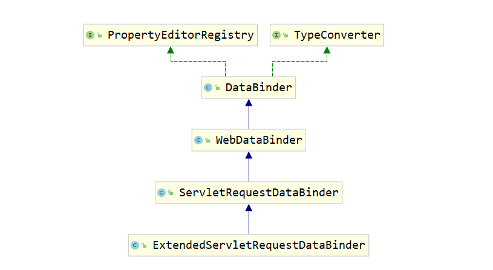

HandlerAdapter作为SpringMVC中最复杂的一部分, 在真正的分析其源码之前, 我们有必要对一些前置知识点进行了
解, 否则在看源码的过程中会遇到盲点.....

### @ModelAttribute
```java
先说说这个注解的作用吧, 被@ModelAttribute标注的方法, 在Controller方法执行前, 都会执行一次该注解标注的
方法, 下面先来看一个例子:
@Controller
public class TestController {
    @PostMapping( "/test" )
    public String test() {
        System.out.println( request );
        return "index";
    }

    @ModelAttribute
    public void testModelAttribute1 () {
        System.out.println( "Hello" );
    }
}

分析:
    当我们每次请求这个/test的时候, 在SpringMVC调用test方法之前, 都会调用一次testModelAttribute1方法,
    当然, 这仅仅知识@ModelAttribute注解的一个小功能而已

@ModelAttribute: 
    对Model的属性进行定义、操作, Model是一个贯穿整个SpringMVC的东西, 相信大家接触该框架时必然少不了对
    Model的学习, 其实Model的本质就是一个Map而已, 在我们进行参数绑定到Controller方法的时候, 数据的来源
    有好几个地方, 比如Request请求参数, session的Atrribute中, 以及这个Model(是一个Map), 
    @ModelAttribute的注解的作用有两个, 当作用在方法上的时候, 方法的返回值就会被放入
    到这个所谓的Model中, 如果指定了@ModelAttribute注解的value属性, 那么该value属性就作为Model中的key
    返回值作为值, 如果没有指定, 那么就会按照一定的生成规则生成key, 当作用在方法参数上的时候, 表示从
    Model中取出参数并赋值给该参数, 如果指定了@ModelAttribute注解的value属性, 那么就从Model中取得对应
    的key所在的value, 下面我们举个例子来说明:

例子:
    @GetMapping( "/test" )
    public String test (@ModelAttribute( "username" ) String username, 
                            @ModelAttribute List<String> list, Model model) {
        System.out.println( model );
        System.out.println( username );
        System.out.println( list );
        return "index";
    }

    @ModelAttribute( "username" )
    public String testModelAttribute1 () {
        return "zhangsan";
    }

    @ModelAttribute
    public List<String> testModelAttribute2 () {
        return Arrays.asList( "a", "b" );
    }

输出:
    {username=zhangsan, stringList=[a, b]}
    zhangsan
    [a, b]

分析:
    结合前面所说的, 被@ModelAttribute注解标注的方法, 在每次执行该Controller的方法(即test方法)前都会
    执行一次, 并且将返回值放入到Model对象中, 而我们的hanler(之后请求映射方法如test都称为handler)在被
    执行的时候, @ModelAtrribute方法标注的参数就会从Model中获取, 可以看到, 输出Model的时候, 里面是保存
    了两个值的, 我们返回的集合其对应的key即stringList, 在没有主动指定该注解的value的情况下, key是按照
    一定规则生成的, 当我们参数绑定的时候, 如果没有主动指定该注解的值, 也会自动从Model中取出一个最合适的

小小的总结:
    @ModelAttribute的作用有两个, 被该注解标注的方法在每次其所在的Controller的hanler执行前都会执行一次
    并且将返回值放入到Model中, 被该注解标注的hanler的属性, 在获取值的时候就会从Model中获取, 那如何做到
    仅仅从Model中获取呢?这个就跟HandlerAdapter中的参数解析器ArgumentResolver有关系了, 如果是从下一篇
    文章过来的同学, 笔者应该是先把参数解析器说明了才引入ModelAttribute的, 所以这里应该不会迷惑什么是参
    数解析器了, 当然, 不懂也没关系, 这里仅仅需要了解这个注解的作用就好了, 其他的看到后面自然会豁然开朗
```

### @SessionAttributes
```java
@SessionAttributes的作用其实跟上面我们所说的Model有点关系, 我们知道, Model其实是一个Map, 
@ModelAttribute的作用就是往这个Map中放入key-value或者根据key从这个Map中取得值, 但是貌似只能作用在同一
个请求中, 因为@ModelAttribute中的Model仅仅是会在一个请求中有效而已, 如果想要在多个请求中实现参数的传递
大家应该可以想到, session就能够实现了, session中保存的属性是一次会话中会持续有效的, 所以如果有多个请求
的话, 就能利用session来传递数据, 而@SessionAttribute的作用就是往session中放入数据, 
SessionAttributes这个注解只能作用在一个类上, 他的作用其实很简单, 当请求结束的时候, 会将Model这个map中
的数据全部的保存到session中, 而在请求来的时候, Model中的数据除了会从@ModelAttribute中放入外, 还会从
session中取出@SessionAttributes规定的数据, 可能这样说比较抽象, 下面我们利用两个handler来证明一下:

@Controller
@SessionAttributes( names={"username"} )
public class TestController1 {
    @GetMapping( "/request1" )
    public String request1 (Model model) {
        model.addAttribute( "username", "lisi" );
        return "index";
    }

    @GetMapping( "/request2" )
    public String request2 (@ModelAttribute( "username" ) String username) {
        System.out.println( username );
        return "index";
    }
}

分析:
    先请求/request1, 再请求/request2, 会发现, 第二次请求打印了lisi, 其实很简单, 当我们执行第一次请求
    即/request1的时候, 往Model中放入了username->lisi, 由于@SessionAttributes中指定了name为username
    所以在hanlder执行完毕时, 就会将Model中key为username的键值对放入到session中, 当第二次请求过来的时
    候, 除了会将@ModelAttribute作用在方法的返回值放入Model外, 还会从session中将@SessionAttributes指
    定的key找到value, 然后放入到Model中, 当第二次请求执行到handler中时, Model中已经存在username这个
    键值对了

应用场景:
    需要注意的是, @SessionAtrributes的作用域可是一个类, 即仅仅会将该类中的请求中Model的指定数据放入
    session中, 同时, 也仅仅会从session中取出该类定义的@SessionAttributes中规定的参数而已, 并且可以看
    到, 由于保存到session中, 所以可以在多个请求中传递参数, 而我们重定向redirect是没法传递参数的, 可以
    通过这个方式来实现参数的传递, 下面来看一个例子

@Controller
@SessionAttributes( names={"username"} )
public class TestController1 {
    @GetMapping( "/request1" )
    public String request1 (Model model) {
        model.addAttribute( "username", "lisi" );
        return "redirect:request2";
    }

    @GetMapping( "/request2" )
    public String request2 (String username, SessionStatus sessionStatus) {
        System.out.println( username );
        sessionStatus.setComplete();
        return "index";
    }
}

分析:
    和前面的例子类似, 不同的是增加了一个SessionStatus类型的参数, 这个参数SpringMVC会自动帮我们注入,
    其实还是利用了参数解析器, 可以发现, /request1往model中放入了username->lisi, 同时
    @SessionAttributes指定了username会放入session中, 于是重定向到/request2时候, username的值就能从
    model中获得, 但是我们调用sessionStatus.setComplete方法, 这个方法的意义是清空@SessionAttributes
    中保存到session中的数据

到此, @SessionAttributes的作用就说完了, 这样我们就可以在之前的源码中看到, SpringMVC是如何完成这些操作
的
```

### @InitBinder
#### DataBinder
```java
在上篇文章中, 我们了解到了, BeanWrapper对属性的设置原理其实是依赖于Java内省机制的PropertyDescriptor的
同时其提供了自定义解析器的功能, 通过registerCustomEditor方法往BeanWrapper中注入PropertyEditor的实现
类来完成的, 通常情况下是字符串转对象, 此时会采用PropertyEditorSupport这个类, 重写其setAsText或者
getAsText方法即可, 从而完成了转换, 本节讲解的DataBinder跟BeanWrapper类似, 因为DataBinder所做的任何事
情都是基于BeanWrapper来完成的, 先来看一个例子吧:
public static void main(String[] args) {
    Customer customer = new Customer();

    DataBinder binder = new DataBinder( customer );

    MutablePropertyValues propertyValues = new MutablePropertyValues();
    propertyValues.add( "birth", new Date() );

    binder.bind( propertyValues );
    System.out.println( customer );
}

分析:
    可以看到, 将MutablePropertyValues中的属性绑定到对象Customer中, 是不是跟BeanWrapper有点类似呢?因
    为Customer的birth属性是Date类型的, 所以直接绑定没有关系, 那么假设我提供的是字符串就绑定不了, 于是
    跟BeanWrapper类似, 可以通过registerCustomEditor方法来注册一个自定义的解析器, 比如字符串解析器:

    public static void main(String[] args) {
        Customer customer = new Customer();

        DataBinder binder = new DataBinder( customer );

        MutablePropertyValues propertyValues = new MutablePropertyValues();
        propertyValues.add( "birth", "2020-06-26 14:33:22" );

        binder.registerCustomEditor(Date.class, new PropertyEditorSupport() {
            @Override
            public void setAsText(String text) throws IllegalArgumentException {
                SimpleDateFormat dateFormat = new SimpleDateFormat( "yyyy-MM-dd HH:mm:ss" );
                setValue( dateFormat.parse( text ) );
            }
        });

        binder.bind( propertyValues );
        System.out.println( customer );
    }

    输出结果跟上面的一样, 但是我们传入的确是字符串.........这个就是DataBinder的作用, 对一个对象提供
    PropertyValues来进行绑定, 同时可以提供验证器Validator, 这个就不进行分析了, 有兴趣可以研究下
```

#### WebDataBinder以下的继承体系
```
DataBinder是Spring框架本身自带的数据绑定工具, 底层用的是BeanWrapper, 而BeanWrapper的底层又是
PropertyDesciptor以及PropertyEdtitor, 于是在SpringMVC中, 为了更加方便Request中数据到对象的绑定, 在
基于DataBinder上又进一步进行了实现, 如下图所示, WebDataBinder继承了DataBinder, 在其源码中, 其实就是
增加了一些判断而已,. 有一个doBind方法, 是WebDataBinder进行绑定的入口, 在该方法中, 做了一些判断, 最后
还是调用了父类DataBinder的doBind方法, 再往后就是ServletRequestDataBinder以及
ExtendedServletRequestDataBinder, 这两个binder完成的任务就是将request对象中的param全部取出来并封装成
PropertyVlues, 然后调用父类的doBind的方法的时候传入从而进行绑定, 这里就不进行深入分析了, 大家只需要清楚
当我们在利用HttpServletRequest对象的getParameterValues获取到值后, 对handler进行绑定其实就是创建一个
ExtendedServletRequestDataBinder, 然后将handler中的参数对象以及HttpServletRequest对象传入进入就可以
完成绑定了, 下面是伪代码:

@RequestMapping( "/test" )
public String test (Customer customer) {
    System.out.println( customer );
    return "index"
}

当在执行参数绑定的时候, 伪代码如下:
    HttpServletRequest request = getHttpServletRequest();
    Customer customer = new Customer();

    ServletRequestDataBinder binder = new ServletRequestDataBinder(customer);
    binder.bind(request);
```



#### @InitBinder
```java
先来看一个例子吧：
@Controller
public class TestController1 {
    @InitBinder
    public void initBinder (WebDataBinder webDataBinder) {
        webDataBinder.registerCustomEditor( Date.class, new PropertyEditorSupport() {
            @Override
            public void setAsText(String text) throws IllegalArgumentException {
                SimpleDateFormat dateFormat = new SimpleDateFormat( "yyyy-MM-dd HH:mm:ss" );
                try {
                    setValue( dateFormat.parse( text ) );
                } catch (ParseException e) {
                    e.printStackTrace();
                }
            }
        });

    }

    @GetMapping( "/request1" )
    public String request1 (Date date) {
        System.out.println( date );
        return "index";
    }
}

分析:
    我们请求的url: 127.0.0.1/request1?date=1997-11-23 14:00:00
    当请求过来的时候, 正常情况下是没法将"1997-11-23 14:00:00"转为Date对象的, 但是我们手动往
    WebDataBinder中注册了一个PropertyEditor, 同时指定类型为Date类型, 所以当其绑定Date类型的时候就会
    利用这个PropertyEditor进行转换了

    那么@InitBinder的意思就很明显了, 在每次请求执行前都会执行@InitBinder对应的方法, 我们可以通过这种
    方式手动注册自己需要的参数解析器, 从整体来看, 貌似跟@ModelAttribute的作用时机是差不多的, 都是请求
    执行前会执行一次, 而@ModelAttribute作用在方法上的时候, 会将返回值放入Model中, 而@InitBinder则是
    允许我们初始化WebDataBinder, 之后的源码分析也可以清晰的看到这两点
```

### @ControllerAdvice
```
在上面的分析中, 我们主要引入了三个注解, 分别是@ModelAttribute、@SessionAttributes、@InitBinder, 这
三个注解中, @ModelAttribute注解能作用在方法和handler的方法参数上, @SessionAttributes只能作用在类上,
并且是以类为作用域的, 不同类之前不能共享, @InitBinder只能作用在方法上, 以上三个注解都是对自己所在的
Controller生效, 那么问题来了, 如果有多个Controller, 每个Controller都需要执行一样的@ModelAttribute
和@InitBinder标注的方法, 那么这两个注解标注的方法就会被复制多份并放到不同的类中, 于是为了防止这样的情况
出现, SpringMVC提供了一个全局的方式, 只需要创建一个@ControllerAdvice注解标注的类, 然后将这两个注解标注
的方法放到该类中, 就实现了全局的操作了, 而不用每个类放置一份, 同时, @ControllerAdvice还提供了卓多属性,
使得我们能够灵活的配置作用的包、类等
```
