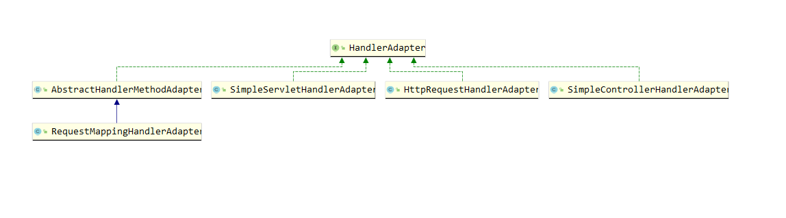

简单的回顾一下前面笔者对HandlerMapping源码的分析, 着重分析了以方法作为Handler这一派系的体系结构, 
SpringMVC通过监听器的回调来触发九大策略的初始化流程, 其实九大策略的初始化流程是差不多的, 首先判断是否应
该检测容器中所有的该策略实现类, 如果是则获取这些实现类的对象并保存到DispatcherServlet中的局部变量中, 如
果不是则取第一个, 那如果容器中没有对应的实现类对象的话, 则会通过读取配置文件来获取对应的默认策略(可能有
多个), 对于RequestMappingHandlerMapping, 是我们日常使用中最为频繁的, SpringMVC通过扫描整个Spring容器
获取所有的对象, 然后对这些对象进行扫描, 仅仅过滤@Controller或者@RequestMapping注解标注的对象, 对这些
对象的方法进行遍历, 每一个被@RequestMapping标注的方法都会被封装成一个handler, 用泛型T表示, 之所以用泛型
的原因笔者就不进行介绍了, 大家有兴趣的可以去了解下(因为这是一个RequestCondition), 在我们分析中, 或者说
正常情况下只要将这个泛型T当成RequestMappingInfo就好了, RequestMappingInfo就是一个@RequestMapping注
解的对象表示形式, 一个RequestMappingInfo对象对应一个HandlerMethod, HandlerMethod是对该注解标注的方法
的封装, 保存了Method, bean对象的引用, 这样的一种关系被放在了AbstractHandlerMethodMapping对象中的属性
mappingRegistry中的mappingLookup中, SpringMVC还将url到RequestMappingInfo的关系保存到了
mappingRegistry中的urlLookup中, 可能有点绕, 简单的说, AbstractHandlerMethodMapping不直接保存url、
RequestMappingInfo、HandlerMethod的引用关系, 而是通过一个MappingRegistry类来保存, 而在请求过来的时候
就是去这个类中的两个map找到对应的HandlerMethod的, 这个HandlerMethod也被称为handler

### HandlerAdapter引入
```
那简单的回顾了一下HandlerMapping的源码执行流程, 我们知道, 当SpringMVC启动完成的时候, url、
RequestMappingInfo、HandlerMethod的引用关系就已经保存到了AbstractHandlerMethodMapping中了, 请求过来
的时候, 就会从中取到对应的HandlerMethod, 从而开始处理请求, 由于我们仅仅说了其中一种HandlerMapping的情
况, 但是SpringMVC中可是有很多个HandlerMapping类型的, 其他的HandlerMapping类型就不是通过HandlerMethod
来处理请求了, 比如直接实现HttpServlet接口的就通过调用该接口的doXXX方法来执行的, DispatcherServlet中为
了能够统一这些调用方式, 比如在处理请求时, 不管获取到的handler是什么类型的, 都通过调用其handle方法去处理

然而不可能直接去修改源代码, 于是就引入了适配器模式, 下面我们先来看看HandlerAdapter接口的定义吧

public interface HandlerAdapter {
  boolean supports(Object handler);

  ModelAndView handle(HttpServletRequest request, HttpServletResponse response, Object handler)

  long getLastModified(HttpServletRequest request, Object handler);
}

简简单单的三个方法, 第三个方法我们不进行分析, 跟http协议相关, 首先来看看第一个方法, 传入一个Object类型
的handler, 判断当前HandlerAdapter是否能够处理该handler, 其实很简单, 对于HandlerMethod类型的handler
来说, 仅仅需要判断其是不是HandlerMethod类型就好了, 对于HttpServlet类型的来说, 就判断是不是HttpServlet
类型

第二个方法, 就是我们前面提到的, 需要统一所有handler的调用方式, 其实在SpringMVC中, 就是通过找到一个
handler对应的HandlerAdapter, 然后调用HandlerAdapter的hanle方法进行处理请求的, 所以不同的hanler仅仅
需要提供不同的适配器就好了, 举个例子, HanlerMethod类型的hanler, 仅仅需要在这个handle方法中调用
HandlerMethod中Method对象的invoke方法就好了, 其他的也是类似, 但是对于HandlerMethod却没有想象中那么简
单
```

### HandlerAdapter继承体系分析
```java
如下图所示, HandlerAdapter一共有5个实现类, 其中最难, 最重要的就是AbstractHandlerMethodAdapter这一派
系, 我们也会着重的讲解这个Adapter是如何处理HandlerMethod的, 剩下三个实现类就简单多了, 我们以
HttpRequestHandlerAdapter为例子看看其如何实现HandlerAdater接口的吧:

public class HttpRequestHandlerAdapter implements HandlerAdapter {
	public boolean supports(Object handler) {
		return (handler instanceof HttpRequestHandler);
	}

	public ModelAndView handle(HttpServletRequest request, 
                                                HttpServletResponse response, Object handler) {
		((HttpRequestHandler) handler).handleRequest(request, response);
		return null;
	}

	public long getLastModified(HttpServletRequest request, Object handler) {
		if (handler instanceof LastModified) {
			return ((LastModified) handler).getLastModified(request);
		}
		return -1L;
	}
}

很简单, 就是调用了HttpRequestHandler类的handleRequest方法而已, 我们可以通过实现一个XXXController, 并
且这个Controller继承HttpRequestHandler, 然后注册到容器中就好了, 与此同时我们需要将
HttpRequestHandlerAdapter放到容器中, 然而该适配器同时也是默认策略中的其中一个, 所以我们也不用将这个适
配器手动放入

简单的看了下继承结构, 接下来我们就要详细的分析AbstractHandlerMethodAdapter这一派系的内容了
```




### AbstractHandlerMethodAdapter源码
```java
下面仅仅将该类的主要实现放出来, 其实现的Ordered接口, 以及WebContentGenerator就不进行解释了, 因为这两个
接口意义都不太大, 我们的核心是这个适配器如何处理HandlerMethod类型的handler的
public abstract class AbstractHandlerMethodAdapter implements HandlerAdapter {
    public final boolean supports(Object handler) {
        return (handler instanceof HandlerMethod && supportsInternal((HandlerMethod) handler));
    }

    protected abstract boolean supportsInternal(HandlerMethod handlerMethod);

    public final ModelAndView handle(HttpServletRequest request, HttpServletResponse response, Object handler)
			throws Exception {

		return handleInternal(request, response, (HandlerMethod) handler);
	}

    protected abstract ModelAndView handleInternal(HttpServletRequest request,
			HttpServletResponse response, HandlerMethod handlerMethod) throws Exception;
}

分析:
    那可以看到, AbstractHandlerMethodAdapter实现的HandlerAdapter的方法中, supports方法实现很简单,
    就是判断是否是HttpMethod类型而已, 同时增加了一个supportsInternal的判断, 然而这个判断在子类
    RequestMappingHandlerAdapter中是直接返回true的, 所以我们可以认为, 当一个Handler是HandlerMethod
    类型的时候, 就会被这个适配器处理

    再来看看handle方法, 实现也很简单, 调用了方法handleInternal, 将handler强转为HandlerMethod类型
    就ok了, 子类RequestMappingHandlerAdapter对这个handleInternal进行了实现, 所以我们的重点就出来了
```

### RequestMappingHandlerAdapter整体结构
#### 一、属性分析
- ArgumentResolver
```java
private List<HandlerMethodArgumentResolver> customArgumentResolvers;
private HandlerMethodArgumentResolverComposite argumentResolvers;

分析: 
    ArgumentResolvers, 用于参数解析, 当我们在调用HandlerMethod的时候, 必然是先取到其里面保存的Method
    对象, 以及bean对象的, 然后利用反射: method.invoke(bean, args) 来完成调用, 并且可以联想到, 我们日
    常使用的时候, 可能会有以下几种参数的使用方式:
        @RequestMapping( "/test" )
        public String test (@RequestBody User user, @RequestParam("name") String name,
        HttpServletRequest httpServletRequest, HttpSession httpSession) {
            return "index";
        }

    而参数解析器就是在这个时候启作用的, 不同的参数解析器解析不同类型的参数, 比如
    RequestResponseBodyMethodProcessor参数解析器就是用来解析@RequestBody注解的参数的, 在SpringMVC
    中, 反射调用HandlerMethod之前, 会利用参数解析器先取得对应的参数, 然后才反射调用, 这些参数的来源之后
    我们再进行分析, 总之通过参数解析器能够获得对应的参数就够了, 再来看看参数解析器接口的定义:

    public interface HandlerMethodArgumentResolver {
	    boolean supportsParameter(MethodParameter parameter);

	    Object resolveArgument(MethodParameter parameter, ModelAndViewContainer mavContainer,
		                	NativeWebRequest webRequest, WebDataBinderFactory binderFactory)
    }  

    可以联想到, supportsParameter方法就是用来判断一个参数是否能用该参数解析器来解析, resolveArgument
    就是用来真正解析这些参数的, 而参数值其实就是从该方法的四个参数中获取而已, 我们先不用管这四个参数是什
    么......

再来说说customArgumentResolvers和argumentResolvers的区别吧, 程序员能够手动的注入不同的参数解析器, 或
者SpringMVC提供了默认的参数解析器, 一开始都会放置在customArgumentResolvers中, 当初始化完成
RequestMappingHandlerAdapter的时候, 就会将customArgumentResolvers中的所有参数解析器整合到
argumentResolvers中, argumentResolvers是一个HandlerMethodArgumentResolverComposite类型, Composite
的是整合/综合的意思, 那很好理解了, SpringMVC利用这个类来完成了参数解析器的查找与应用, 因为如果将查找与
应用的代码全部写在HandlerAdapter的话, 就会呈现耦合的情况, 将这些对参数解析器的操作全部抽离出来放到一个
额外的类中, HandlerAdapter持有该类对象的引用就可以进行解耦了, HandlerMethodArgumentResolverComposite
中就是维护了一个HandlerMethodArgumentResolver的集合而已
```

- ReturnValueHandler
```java
private List<HandlerMethodReturnValueHandler> customReturnValueHandlers;

private HandlerMethodReturnValueHandlerComposite returnValueHandlers;

分析:
    ReturnValueHandler跟上面的参数解析器很相似, 这个是用来解析HandlerMethod调用的返回值的, 同样的, 也
    分为很多类型的ReturnValueHandler, 比如我们@ResponseBody就是用RequestResponseBodyMethodProcessor
    这个类来完成解析的, 这个时候, 大家就会发现, 这个类好像似曾相识!!因为@RequestBody也是它来解析的!!!

    与此同时, 上面两个变量的意思我就不进行解释了, 跟ArgumentResovler是一模一样的处理情况
```

- HttpMessageConverter
```java
private List<HttpMessageConverter<?>> messageConverters;

分析:
    这个messageConverters在我们SpringMVC中起着极其重要的作用, 我们在处理返回值的时候, @ResponseBody
    注解标注的方法中, 返回值会被当成JSON处理, 然而我们返回的是一个对象, 竟然变成了一个JSON, 就是这个
    消息转换器起的作用, 举个简单的例子, 如果用@ResponseBody标注了, 那么返回的时候就会利用Jackson将这个
    对象利用ObjectMapper转为JSON, 这个大家应该就很熟悉了
```

- SessionAttributes
```java
private SessionAttributeStore sessionAttributeStore = new DefaultSessionAttributeStore();

private final Map<Class<?>, SessionAttributesHandler> sessionAttributesHandlerCache 
                                                                = new ConcurrentHashMap<>(64);

分析:
    先来看看SessionAttributeStore, 这个类是一个工具类, 他是帮助我们将key-value放到session中的, 其只
    有一个子类DefaultSessionAttributeStore, 该子类实现了SessionAttributeStore接口的三个方法, 实现
    很简单, 如下:
    public class DefaultSessionAttributeStore implements SessionAttributeStore {
        public void storeAttribute(WebRequest request, String attributeName, Object attributeValue) {
            String storeAttributeName = getAttributeNameInSession(request, attributeName);
            request.setAttribute(storeAttributeName, attributeValue, WebRequest.SCOPE_SESSION);
        }

        public Object retrieveAttribute(WebRequest request, String attributeName) {
            String storeAttributeName = getAttributeNameInSession(request, attributeName);
            return request.getAttribute(storeAttributeName, WebRequest.SCOPE_SESSION);
	    }

        public void cleanupAttribute(WebRequest request, String attributeName) {
            String storeAttributeName = getAttributeNameInSession(request, attributeName);
            request.removeAttribute(storeAttributeName, WebRequest.SCOPE_SESSION);
        }
    }

    ok, 可以看到, 以storeAttribute为例子, 利用WebRequest对象将属性设置到了session中, 这个方法有三个
    参数, 属性名、属性值、作用域, 作用域就两个选择, 一个是session作用域, 一个是request作用域, 如果作用
    域选择前者, 那么就把key-value设置到session中, 如果是后者则将key-value设置到request中, 很简单吧..

    再来看看sessionAttributesHandlerCache这个Map, key为Class对象, 值为SessionAttributesHandler, 
    SessionAttributesHandler是@SessionAttributes这个注解的对象表示形式, 根据前一篇文章可以得知, 
    @SessionAttributes作用域是类, 所以这个map表示的是类名到该类所在@SessionAttributes的映射

    public class SessionAttributesHandler {
        private final Set<String> attributeNames = new HashSet<>();
        private final Set<Class<?>> attributeTypes = new HashSet<>();
        private final Set<String> knownAttributeNames = Collections.newSetFromMap(new ConcurrentHashMap<>(4));

        private final SessionAttributeStore sessionAttributeStore;
    }

    我们可以在@SessionAttributes注解上配置name、type, 对应到SessionAttributesHandler中的
    attributeNames, attributeTypes, 为了能够将这两个统一, 方便直接利用name进行查找, SpringMVC引入了
    knownAttributeNames, 因为我们配置了type的情况下, 一个请求结束后, 这个请求中的Model对象中, 如果是
    这个type属性中的一个, 那么这个Model中该key-value就会被放到session中, 与此同时, 之后为了能够直接用
    name从session中获取, 又将其保存到了knownAttributeNames中, 即整合了attributeNames和
    attributeTypes, 同时SessionAttributesHandler中内置了SessionAttributeStore, 理由很简单, 
    SessionAttributeStore对象是用来帮助设置key-value到session以及从session中获取的, 那么内置一个该
    对象就能直接在SessionAttributesHandler中操作了, 这个SessionAttributeStore真正被创建是在
    RequestMappingHandlerAdapter中的, 因为只要有一份该工具就好了, SessionAttributesHandler中仅仅是
    持有该工具的引用而已, 通过构造方法传进来的
```

- InitBinder && ModelAttribute
```java
private final Map<Class<?>, Set<Method>> initBinderCache = new ConcurrentHashMap<>(64);

private final Map<ControllerAdviceBean, Set<Method>> initBinderAdviceCache 
                                                                    = new LinkedHashMap<>();

private final Map<Class<?>, Set<Method>> modelAttributeCache = new ConcurrentHashMap<>(64);

private final Map<ControllerAdviceBean, Set<Method>> modelAttributeAdviceCache 
                                                                    = new LinkedHashMap<>();

private HandlerMethodArgumentResolverComposite initBinderArgumentResolvers;

分析:
    经过前一篇文章的分析, 我们清楚的了解了@InitBinder和@ModelAttribute的作用, 那么对于这两个注解标注
    的方法来说, 就是分别保存到了initBinderCache和modelAttributeCache, 可以看到, key为Controller对象

    可以看到, 一个Controller是允许多个该注解标注的方法的, 那么如果是全局的呢?即@ControllerAdvice中的,
    就会被分别放入到initBinderAdviceCache和modelAttributeAdviceCache中

    因为我们调用@InitBinder标注的方法的时候, 是可以传入参数的, 参数的解析就是用
    initBinderArgumentResolvers, 可以看到其类型是HandlerMethodArgumentResolverComposite, 即多个参
    数解析器会被放到这个类中, 但是我们正常的handler的参数解析确是用的上面提到的argumentsResolvers, 这
    点需要注意
```

#### 二、构造器分析
```java
讲解完属性相关的, 就该来讲一下构造器了, 同时也是RequestMappingHandlerAdapter源码分析的第一步, 使用该
对象必须得先创建该对象:

public RequestMappingHandlerAdapter() {
    StringHttpMessageConverter stringHttpMessageConverter = new StringHttpMessageConverter();
    stringHttpMessageConverter.setWriteAcceptCharset(false);  // see SPR-7316

    this.messageConverters = new ArrayList<>(4);
    this.messageConverters.add(new ByteArrayHttpMessageConverter());
    this.messageConverters.add(stringHttpMessageConverter);
    this.messageConverters.add(new SourceHttpMessageConverter<>());
    this.messageConverters.add(new AllEncompassingFormHttpMessageConverter());
}

可以看到, 构造器中就是创建了一系列的HttpMessageConverter, 这里我举个例子, 我们日常使用的@ResponseBody
来说: 
@Controller
public class TestController1 {
    @GetMapping( "/request1" )
    @ResponseBody
    public List<String> request1 () {
        return Arrays.asList( "A", "B" );
    }
}

分析:
    在请求/request1的时候, 被@ResponseBody标注的返回值会被之前我们所说的ReturnValueHandler进行处理,
    真正是用RequestResponseBodyMethodProcessor处理的, 首先转JSON, SpringMVC用的是jackson包提供的
    序列化JSON的功能, 所以我们要引入这个jackson包, 否则是请求执行过来会报错的, 其次, 在本小结讲解的
    RequestMappingHandlerAdapter的构造器中, 就将用这个jackson序列化JSON的类放入进去了, 我们来看看
        this.messageConverters.add(new AllEncompassingFormHttpMessageConverter());
    先来看看AllEncompassingFormHttpMessageConverter这个类中的其中一部分吧:
    public class AllEncompassingFormHttpMessageConverter extends FormHttpMessageConverter {
        private static final boolean jackson2Present =
			ClassUtils.isPresent("com.fasterxml.jackson.databind.ObjectMapper", 
                            AllEncompassingFormHttpMessageConverter.class.getClassLoader()) &&
            ClassUtils.isPresent("com.fasterxml.jackson.core.JsonGenerator", 
                            AllEncompassingFormHttpMessageConverter.class.getClassLoader());

        public AllEncompassingFormHttpMessageConverter() {
            if (jackson2Present) {
                addPartConverter(new MappingJackson2HttpMessageConverter());
            }
        }
    }

    ClassUtils.isPresent方法很简单, 就是try...catch, try里面是直接利用Class.forName反射获取传入的字
    符串, 如果反射创建失败, 说明不存在这个类, 于是catch中捕捉到异常, 但是什么也不做, 这个类被初始化的
    时候, 就判断是否存在ObjectMapper这个类了, 一个与判断, 如果为true, 则构造方法中就将这个
    MappingJackson2HttpMessageConverter的消息转换器放入到自身内部保存的partConverters属性中

    而MappingJackson2HttpMessageConverter中就持有一个ObjectMapper对象, 判断一个消息转换器是否适合
    当前返回值是这样的判断的, 以上面的请求例子进行分析, 返回的是一个List<String>, 当返回的时候, 如果请
    求该url时携带了对应的mediaType, 比如"application/json", 那么就会利用这个消息转换器进行返回值的处
    理, 笔者之前就在这里被坑过....直接用浏览器get请求发过来, 发现返回值是一个xml.....因为判断到底用哪个
    消息转换器肯定是通过遍历的方式一个个判断的, 由于请求过来的时候没有明确指定是content-type, 所以还没
    遍历到MappingJackson2HttpMessageConverter就已经找到转换器了
```

#### 三、afterPropertiesSet进一步初始化
```java
public void afterPropertiesSet() {
    initControllerAdviceCache();

    if (this.argumentResolvers == null) {
        List<HandlerMethodArgumentResolver> resolvers = getDefaultArgumentResolvers();
        this.argumentResolvers = new HandlerMethodArgumentResolverComposite().addResolvers(resolvers);
    }
    if (this.initBinderArgumentResolvers == null) {
        List<HandlerMethodArgumentResolver> resolvers = getDefaultInitBinderArgumentResolvers();
        this.initBinderArgumentResolvers = new HandlerMethodArgumentResolverComposite().addResolvers(resolvers);
    }
    if (this.returnValueHandlers == null) {
        List<HandlerMethodReturnValueHandler> handlers = getDefaultReturnValueHandlers();
        this.returnValueHandlers = new HandlerMethodReturnValueHandlerComposite().addHandlers(handlers);
    }
}

分析:
    初始化很简单, 第一步initControllerAdviceCache的做法就是初始化全局的ControllerAdvice中定义的
    @ModelAttribute以及@InitBinder, 将这些全局的方法找出来放入到对应的cache中, 前面已经详细分析过了相
    关的cache了, 同时找到被@ControllerAdvice注解标注的类同时实现了RequestBodyAdvice或者
    ResponseBodyAdvice接口的, 将他们放入到对应的属性中, 这个RequestBodyAdvice或者
    ResponseBodyAdvice接口大家有兴趣可以了解下, 这里就不进行展开了, 后者就是对请求返回的数据的一种扩展
    处理而已

    之后三步, 获取到所有的默认的ArgumentResolvers、InitBinderArgumentResolvers以及
    ReturnValueHandlers, 然后放到复合类HandlerMethodArgumentResolverComposite中, 也很简单, 就是直
    接new对应的组件而已, 我们可以用getDefaultArgumentResolvers的一部分代码来进行演示:

    private List<HandlerMethodArgumentResolver> getDefaultArgumentResolvers() {
        List<HandlerMethodArgumentResolver> resolvers = new ArrayList<>();
        resolvers.add(new RequestResponseBodyMethodProcessor(getMessageConverters(),
                                                                this.requestResponseBodyAdvice));
        resolvers.add(new RequestParamMethodArgumentResolver(getBeanFactory(), false));
        if (getCustomArgumentResolvers() != null) {
            resolvers.addAll(getCustomArgumentResolvers());
        }

        return resolvers;
    }

    可以看到, 就是直接new而已, 如果程序员手动提供的不为空, 也会放入到里面, 最后将这些返回
```

### RequestMappingHandlerAdapter处理HandlerMethod
#### handleInternal方法入口
```java
protected ModelAndView handleInternal(HttpServletRequest request,
        HttpServletResponse response, HandlerMethod handlerMethod) throws Exception {

    ModelAndView mav;
    checkRequest(request);
    
    mav = invokeHandlerMethod(request, response, handlerMethod);

    if (!response.containsHeader(HEADER_CACHE_CONTROL)) {
        if (getSessionAttributesHandler(handlerMethod).hasSessionAttributes()) {
            applyCacheSeconds(response, this.cacheSecondsForSessionAttributeHandlers);
        }
        else {
            prepareResponse(response);
        }
    }

    return mav;
}

分析:
    在这个方法中, 笔者删除了对session同步的判断, 这里大家不用纠结, 没啥意义.....为了让代码简单易懂, 就
    进行了这样的处理, 可以看到, 整个handleInternal方法仅仅做了三件事而已, 最后返回了一个ModelAndView,
    注意了, ModelAndView的意思是Model和View的结合体, 结合上一篇文章的分析, 我们知道了Model这个对象是
    贯穿了整个请求的执行过程的, 其就是一个Map而已, view是视图, 是我们执行完请求后要返回给前端的东西, 视
    图怎么解析的我们下一章节再详细分析

    checkRequest方法就是做了一些检查, 判断当前请求方式是否被支持, 通常情况下是所有请求方式都会支持的,
    我们所说的@GetMapping以及@PostMapping这样规定请求方式不是在这里判断的, 因为此时还处于外层, 还没开
    始处理HandlerMethod, 其次对session进行了判断, 如果session是必须的, 但是当前请求中又不存在的
    session的话就抛出一个异常

    其次就是核心方法invokeHandlerMethod, 这里传入了HttpServletRequest, HttpServletResponse, 以及
    HandlerMethod进去, 我们之后再详细分析这里面的执行流程

    最后是对request缓存的处理, 如果response中没有响应头Cache-Control的话, 就进行一定的处理, 这里就不
    进行分析了......大家有兴趣可以进去看下, 可能有一个判断跟SessionAttributeHandler有关, 如果看完了
    后面对invokeHandlerMethod方法的分析的话, 再来看这个跟SessionAttributeHandler有关的判断就会清晰很
    多
```

#### invokeHandlerMethod
```java
protected ModelAndView invokeHandlerMethod(HttpServletRequest request,
			HttpServletResponse response, HandlerMethod handlerMethod) throws Exception {
    ServletWebRequest webRequest = new ServletWebRequest(request, response);
    try {
        WebDataBinderFactory binderFactory = getDataBinderFactory(handlerMethod);
        ModelFactory modelFactory = getModelFactory(handlerMethod, binderFactory);

        ServletInvocableHandlerMethod invocableMethod = createInvocableHandlerMethod(handlerMethod);
        if (this.argumentResolvers != null) {
            invocableMethod.setHandlerMethodArgumentResolvers(this.argumentResolvers);
        }
        if (this.returnValueHandlers != null) {
            invocableMethod.setHandlerMethodReturnValueHandlers(this.returnValueHandlers);
        }
        invocableMethod.setDataBinderFactory(binderFactory);
        invocableMethod.setParameterNameDiscoverer(this.parameterNameDiscoverer);

        ModelAndViewContainer mavContainer = new ModelAndViewContainer();
        mavContainer.addAllAttributes(RequestContextUtils.getInputFlashMap(request));
        modelFactory.initModel(webRequest, mavContainer, invocableMethod);
        mavContainer.setIgnoreDefaultModelOnRedirect(this.ignoreDefaultModelOnRedirect);

        invocableMethod.invokeAndHandle(webRequest, mavContainer);
        return getModelAndView(mavContainer, modelFactory, webRequest);
    }
    finally {
        webRequest.requestCompleted();
    }
}

分析:
    先贴上代码, 首先说明一点, 笔者将所有跟异步请求相关的代码都删除了, 这一块我也不是很熟悉, 并且没有用
    到过, 而且笔者文章的整体目的是将通常情况下SpringMVC的执行流程给分析出来, 对于一些边边角角又不太常用
    的知识点就不进行分析的

    首先来看看ServletWebRequest, 在前面分析Adapter的SessionAttributes属性相关的时候, 我们是不是传入
    了一个WebRequest对象, 利用这个对象的setAttribute并提供一个作用域来决定将key-value设置到request中
    还是session中, 而那个WebRequest对象就是在这里创建的, 它的子类ServletWebRequest......将request
    和response放入进ServletWebRequest中, 之后可以通过这个对象获取request和response相关的信息, 以及设
    置key-value到request或者session中

    接下来我们一个个分析这些代码中涉及到的组件, 相信有了前面一章节以及本章节前面对Adapter属性的分析, 后
    面对这些组件分析大家会听起来看起来很顺畅
```

#### WebDataBinderFactory
```java
将这个组件的名称可以理解为两部分, WebDataBinder以及Factory, 顾名思义, 就是WebDataBinder对象工厂, 所以
核心就是这个WebDataBinder了, 之前也分析过@InitBinder可以对WebDataBinder进行初始化, 同时@InitBinder有
两种形式存在, 一个是只作用于当前Controller的, 一种是放置在@ControllerAdvice标注的类上全局的

private WebDataBinderFactory getDataBinderFactory(HandlerMethod handlerMethod) throws Exception {
    Class<?> handlerType = handlerMethod.getBeanType();
    Set<Method> methods = this.initBinderCache.get(handlerType);
    if (methods == null) {
        methods = MethodIntrospector.selectMethods(handlerType, INIT_BINDER_METHODS);
        this.initBinderCache.put(handlerType, methods);
    }
    List<InvocableHandlerMethod> initBinderMethods = new ArrayList<>();
    // Global methods first
    this.initBinderAdviceCache.forEach((clazz, methodSet) -> {
        if (clazz.isApplicableToBeanType(handlerType)) {
            Object bean = clazz.resolveBean();
            for (Method method : methodSet) {
                initBinderMethods.add(createInitBinderMethod(bean, method));
            }
        }
    });
    for (Method method : methods) {
        Object bean = handlerMethod.getBean();
        initBinderMethods.add(createInitBinderMethod(bean, method));
    }
    return createDataBinderFactory(initBinderMethods);
}

分析:
    代码其实很简单,首先是从initBinderCache中获取到当前HanlderMethod所在的Controller类中的所有被
    @InitBinder标注的方法, 如果没有获取到, 就利用MethodIntrospector来对该类进行扫描, 这个大家应该很
    熟悉了, 前面对HandlerMapping也是用的MethodIntrospector类进行扫描的, 找到后将其放置到缓存中

    所以第一部分就是找到当前Controller中的所有@InitBinder标注的方法而已, 然后初始化了一个List, 里面存
    储的是InvocableHandlerMethod, 我们之后再分析什么是InvocableHandlerMethod

    第二部分代码就是对initBinderAdviceCache这个全局缓存进行遍历了, 因为之前Adapter初始化的时候就已经
    将容器中所有被@ControllerAdvice标注的类找出来了, 并且将全局的@InitBinder标注的方法存储到了
    initBinderAdviceCache中, 这时候就要从这个缓存中取出能够用在当前Controller的, 前面笔者也有提到,
    @ControllerAdvice是可以配置作用在哪些包, 哪些类的, 这一步就是筛选出这些方法

    第三部分遍历所有的当前Controller中的methods, 将他们变成一个个的InvocableHandlerMethod, 并放入到
    initBinderMethods这个集合中

    最后, initBinderMethods这个集合中保存了当前Controller中以及满足条件的被@ControllerAdvice标注的
    类中的所有@InitBinder标注的方法, 并且这些方法都是封装成了InvocableHandlerMethod的
```

#### InvocableHandlerMethod
```java
看这个名字, 就知道是可调用的HandlerMethod, 没错, 这个类继承了HandlerMethod, 为什么说是可调用的呢?
HandlerMethod中封装了bean对象、Method对象以及参数信息, 但是不能直接调用, 因为没有参数值, 并且调用后的
返回值不一样, 怎么对参数值和返回值进行处理, 就是InvocableHandlerMethod需要做的事情了, 
InvocableHandlerMethod继承了HandlerMethod, 同时提供了几个属性, 看下面的类定义就能够很清楚了:
    public class InvocableHandlerMethod extends HandlerMethod {
        private WebDataBinderFactory dataBinderFactory;

        private HandlerMethodArgumentResolverComposite argumentResolvers 
                                                = new HandlerMethodArgumentResolverComposite();

        private ParameterNameDiscoverer parameterNameDiscoverer 
                                                = new DefaultParameterNameDiscoverer();
    }

可以看到, 就是保存了参数解析器以及WebDataBinderFactor以及一个参数名称查找器而已, 这个参数名称查找器我们
不进行深入分析.....

InvocableHandlerMethod有一个直接子类: ServletInvocableHandlerMethod, 该直接子类增加了一个额外的属性

public class ServletInvocableHandlerMethod extends InvocableHandlerMethod {
	private HandlerMethodReturnValueHandlerComposite returnValueHandlers;
}

那到此为止, InvocableHandlerMethod的作用就很明显了, 在HandlerMethod的基础上增加了参数值、返回值的处理

再回到上一段落, 将这些@InitBinder标注的方法找出来后, 封装成InvocableHandlerMethod, 这样就能够很好的调
用并处理参数了, 最后调用createDataBinderFactory方法, 以InvocableHandlerMethod的集合作为参数, 其实就
是new了一个ServletRequestDataBinderFactory, 需要注意的是, 这里放入的是InvocableHandlerMethod类对象,
而不是ServletInvocableHandlerMethod, 究其原因是@InitBinder是不允许有返回值的, 不信你试试.....所以
压根没必要用ServletInvocableHandlerMethod
```

#### 小小的总结
```
ServletWebRequest保存了HttpServletRequest以及HttpServletResponse, 同时提供了对键值对放入到session
或者request作用域的功能, WebDataBinderFactory就WebDataBinder的工厂方法, 将所有的@InitBinder方法找出
来后放入到了这个工厂方法中, 在每次请求来的时候创建好WebDataBinder后就先执行所有的@InitBinder方法对
WebDataBinder进行初始化, 比如增加自定义的属性编辑器?
```

#### ModelFactory
```java
ModelFactory modelFactory = getModelFactory(handlerMethod, binderFactory);

接下来我们要分析的就是这个ModelFactory了, 前面已经处理完了@InitBinder注解, 将他们放到了
WebInitBinderFactory中, 此时这个ModelFactory就是用来处理@ModelAttribute注解的, 因为我们之前说过, 每
个请求执行的时候都会执行@InitBinder以及@ModelAttribute注解标注的方法

private ModelFactory getModelFactory(HandlerMethod handlerMethod, WebDataBinderFactory binderFactory) {
    SessionAttributesHandler sessionAttrHandler = getSessionAttributesHandler(handlerMethod);
    Class<?> handlerType = handlerMethod.getBeanType();
    Set<Method> methods = this.modelAttributeCache.get(handlerType);
    if (methods == null) {
        methods = MethodIntrospector.selectMethods(handlerType, MODEL_ATTRIBUTE_METHODS);
        this.modelAttributeCache.put(handlerType, methods);
    }
    List<InvocableHandlerMethod> attrMethods = new ArrayList<>();
    // Global methods first
    this.modelAttributeAdviceCache.forEach((clazz, methodSet) -> {
        if (clazz.isApplicableToBeanType(handlerType)) {
            Object bean = clazz.resolveBean();
            for (Method method : methodSet) {
                attrMethods.add(createModelAttributeMethod(binderFactory, bean, method));
            }
        }
    });
    for (Method method : methods) {
        Object bean = handlerMethod.getBean();
        attrMethods.add(createModelAttributeMethod(binderFactory, bean, method));
    }
    return new ModelFactory(attrMethods, binderFactory, sessionAttrHandler);
}

分析:
    代码结构大家应该会感觉很熟悉, 跟@InitBinder的处理是类似的, 都是先处理全局的, 然后才处理局部的, 最后
    将每一个扫描到的方法都封装成InvocableHandlerMethod, 同时赋予参数解析器, 这一步骤是在
    createModelAttributeMethod方法中完成的

    最后, 生成了一个ModelFactory对象, 在这个构造方法中, 将InvocableHandlerMethod又进行了一次包装, 
    变成了ModelMethod, 包装的结果是为了处理@ModelAttribute标注的方法同时其参数也有@ModelAttribute注
    解的情况的, 大家有兴趣跟进去看一下就明白了, 很简单....

    最后需要注意的是, 在整个方法的最开头调用了一个方法getSessionAttributesHandler, 同时将这个方法的返
    回值放入到了ModelFactory中, 首先说下SessionAttributesHandler吧, 前面有专门讲这个组件, 他的作用就
    是@SessionAttributes的类表示形式, 里面有四个参数, 一个是attributeNames, 对应注解中的name, 一个是
    attributeTypes, 对应注解中的type, 而knownAttributeNames这个参数就是将前两个整合起来了而已, 最后
    一个参数是SessionAttributeStore, 提供对session中key-value的操作, 并且我们知道
    SessionAttributesHandler是以类为作用域的, 每个类都会有一个该对象, 为什么这么说呢? 这就是
    getSessionAttributesHandler方法实现的

private SessionAttributesHandler getSessionAttributesHandler(HandlerMethod handlerMethod) {
    Class<?> handlerType = handlerMethod.getBeanType();
    SessionAttributesHandler sessionAttrHandler 
                                        = this.sessionAttributesHandlerCache.get(handlerType);
    if (sessionAttrHandler == null) {
        synchronized (this.sessionAttributesHandlerCache) {
            sessionAttrHandler = this.sessionAttributesHandlerCache.get(handlerType);
            if (sessionAttrHandler == null) {
                sessionAttrHandler 
                            = new SessionAttributesHandler(handlerType, sessionAttributeStore);
                this.sessionAttributesHandlerCache.put(handlerType, sessionAttrHandler);
            }
        }
    }
    return sessionAttrHandler;
}

分析:
    首先根据这个handler方法获取到其所在的Controller的类型, 因为是类作用域, 然后从cache中获取, 一开始
    肯定是没有的, 所以就进入了synchronized关键字, 可以看到, 直接创建了一个该对象, 并且将
    sessionAttributeStore传了进去, 我们之前说过, sessionAttributeStore仅仅是一个用来操作session中
    key-value的工具而已, 所以这一块直接传进去没关系, 大家共享同一个工具就好了...

    最后将创建好的SessionAttributesHandler放到缓存中, 所以说, 即使一个类没有被@SessionAttributes标注
    同样也会创建一个SessionAttributesHandler对象, 只是其里面的那些属性中三个集合都为刚初始化完成的空
    集合而已
```

#### ServletInvocableHandlerMethod
```java
ServletInvocableHandlerMethod invocableMethod = createInvocableHandlerMethod(handlerMethod);
if (this.argumentResolvers != null) {
    invocableMethod.setHandlerMethodArgumentResolvers(this.argumentResolvers);
}
if (this.returnValueHandlers != null) {
    invocableMethod.setHandlerMethodReturnValueHandlers(this.returnValueHandlers);
}
invocableMethod.setDataBinderFactory(binderFactory);
invocableMethod.setParameterNameDiscoverer(this.parameterNameDiscoverer);

接下来是创建ServletInvocableHandlerMethod对象, 这个类是InvocableHandlerMethod的子类, 在其父类的功能
下提供了返回值的解析器, 即returnValueHandlers, 所以其适应于处理真正的handler方法, 可以看到, 将复合的
参数解析器(里面放入了所有初始化好的参数解析器)以及复合的返回值解析器(里面放入了所有初始化好的返回值解析
器)设置到了invocableMethod中, 这时候如果去调用handler方法, 就能很好的解析参数和返回值了, 但是还不够,
我们参数绑定的时候还需要一个WebDataBinder呀, 数据从哪里来我们之后再说, 绑定参数必须要有WebDataBinder
吧, 于是invocableMethod又放入了之前我们创建好的WebDataBinderFactory(创建WebDataBinder的工厂, 同时能
初始化WebDataBinder, 利用@InitBinder注解)
```

#### ModelAndViewContainer
```java
ModelAndViewContainer mavContainer = new ModelAndViewContainer();
mavContainer.addAllAttributes(RequestContextUtils.getInputFlashMap(request));
modelFactory.initModel(webRequest, mavContainer, invocableMethod);
mavContainer.setIgnoreDefaultModelOnRedirect(this.ignoreDefaultModelOnRedirect);

分析:
    通过之前的操作, 我们已经成功的将WebDataBinder、@ModelAttribute以及需要调用的handler准备好了, 此时
    还缺的是数据, 这个数据就放到了ModelAndViewContainer中, 这个容器中存放了所有需要绑定的数据, 以及在
    hanlder方法执行完毕后返回的视图名称

    我们先不分析这个InputFlashMap是干嘛的, 之后还会遇到一个OutputFlashMap, 先不去管他, 笔者之后会专门
    分析这个组件, 它的作用一般用于重定向这样的请求中数据的传递

    所以这几句代码中最重要的就是initModel了, 它的参数是一个webRequest(可以从session中获取当前类的
    SessionAttributesHandler定义的key所对应的值), 一个mavContainer(用来存储所有的数据)

public void initModel(NativeWebRequest request, ModelAndViewContainer container,
			HandlerMethod handlerMethod) throws Exception {
    Map<String, ?> sessionAttributes = this.sessionAttributesHandler.retrieveAttributes(request);
    container.mergeAttributes(sessionAttributes);
    invokeModelAttributeMethods(request, container);

    for (String name : findSessionAttributeArguments(handlerMethod)) {
        if (!container.containsAttribute(name)) {
            Object value = this.sessionAttributesHandler.retrieveAttribute(request, name);
            if (value == null) {
                throw new HttpSessionRequiredException("Expected session attribute '" + name + "'", name);
            }
            container.addAttribute(name, value);
        }
    }
}

分析:
    此时已经到了ModelFactory中了, 结合之前的分析, 我们知道ModelFactory中有该类对应的
    sessionAttributesHandler, 所以此时直接调用该sessionAttributesHandler的retrieveAttributes方法,
    结果是利用该sessionAttributesHandler中的knownAttributeNames, 找到他们在session中对应的值, 然后
    以一个Map返回而已

    我们之前说ModelAndViewContainer有一个作用是用来保存可以用来绑定的参数信息的, 这里就能看到了, 
    container.mergeAttributes的调用其实就是将sessionAttributes这个map的信息转移到了container中对应
    的Model中, 其实就是一个Map, 里面代码很简单, 就不贴出来了, 大家有兴趣看看

    container中除了存放session信息外, 还应该存放@ModelAttribute修饰的方法返回的key-value, 而
    invokeModelAttributeMethods方法的调用就是完成这个功能的, 在该方法中, 首先取出我们之前放入到
    ModelFactory中的所有被@ModelAttribute标注的方法, 在ModelFactory中被放入到了modelMethod属性中,
    然后一个个遍历, 同时调用该方法, 获取返回值, 最后利用一定的名称生成规则生成key(如果注解中有指定name,
    则用指定的name作为key), 最后将这个key-value放入到container中

    到此为止, 我们基本就明白了, initModel方法的功能很简单, 就是初始化ModelAndViewContainer中的Model
    对象(是一个map)中的数据, 就是将满足条件的session数据和@ModelAttribute数据放入到Model中而已....

    接下来就是一个for循环, findSessionAttributeArguments方法的作用是找到当前这个handler中的所有参数
    中被@ModelAttribute标注的参数, 并且这个参数也在sessionAttributesHandler中定义的, 比如:
        @Controller
        @SessionAttributes( value = "customer")
        public class TestController1 {
            @RequestMapping( value="/request1" )
            @ResponseBody
            public Customer request1 (@ModelAttribute( "customer" ) Customer customer) {
                return new Customer();
            }
        }

    比如上面这个例子中的customer这个key, 同时存在于request1这个handler中被@ModelAttribute标注的参数
    中, 也存在于@SessionAttributes标注中

    然后一个个遍历, 如果container中没有, 说明经过前面的初始化还没有找到这个数据, 此时就抛出一个异常, 因
    为我request1方法需要绑定customer这个key对应的属性, 但是没找到, 抛出个异常....
```

#### 小小的总结
```
那到此为止, 我们为了能够执行这个handler方法的准备工作终于做完了, 涉及的组件非常的多, 先来小小的总结一下
这些组件的功能吧:

WebDataBinderFactory: 保存了@InitBinder相关的信息
ModelFactory: 保存了@ModelAttribute以及@SessionAttributes相关信息, 前者的表现形式是一个个的
                InvocableHandlerMethod, 在ModelFactory对象中被包装成ModelMethod, 后者的表现形式是
                SessionAttributesHandler
ServletInvocableHandlerMethod: 真正用来触发调用handler方法的对象, 除了存储了HandlerMethod外, 还存储
                                了需要用到参数解析器、返回值解析器等
ModelAndViewContainer: 调用handler方法, 一定会涉及到绑定的参数, 这些参数被放到了container中, 而参数
                        的来源就是@ModelAttribute以及@SessionAttributes, 即ModelFactory中, 触发点
                        是initModel方法, 数据真正被存放在container中的defaultModel中, 是一个Map, 同
                        时container还会存储handler方法调用完成后的view视图信息, 之后会看到....                      
```

#### 开始调用HandlerMethod
- invokeAndHandle为HandlerMethod调用入口
```java
invocableMethod.invokeAndHandle(webRequest, mavContainer): 这个方法是入口, 接下来我们来看看其内部
                                                            实现吧!!!

public void invokeAndHandle(ServletWebRequest webRequest, ModelAndViewContainer mavContainer,
			Object... providedArgs) throws Exception {

    Object returnValue = invokeForRequest(webRequest, mavContainer, providedArgs);
    setResponseStatus(webRequest);

    if (returnValue == null) {
        if (isRequestNotModified(webRequest) || getResponseStatus() != null 
                                             || mavContainer.isRequestHandled()) {
            mavContainer.setRequestHandled(true);
            return;
        }
    }
    else if (StringUtils.hasText(getResponseStatusReason())) {
        mavContainer.setRequestHandled(true);
        return;
    }

    mavContainer.setRequestHandled(false);
    this.returnValueHandlers.handleReturnValue(
            returnValue, getReturnValueType(returnValue), mavContainer, webRequest);
}

分析:
    先来说一下mavContainer中的requestHandled属性吧, true表示请求执行完毕, false表示请求还没有执行完毕

    其实整个方法中最核心的代码就两行, 一个是调用HandlerMethod方法, 一个是处理返回值, 我们着重分析这两个
    方法
```

- invokeForRequest开始调用HandlerMethod
```java
public Object invokeForRequest(NativeWebRequest request, ModelAndViewContainer mavContainer,
			                                Object... providedArgs) throws Exception {

    Object[] args = getMethodArgumentValues(request, mavContainer, providedArgs);
    Object returnValue = doInvoke(args);
    return returnValue;
}

分析:
    可以看到, 首先是获取参数, 之后就是利用这个参数, 以及HandlerMethod中保存的bean直接反射调用方法了,
    doInvoke中就是反射调用

    getMethodArgumentValues获取参数其实也很简单, 我们之前不是往这个ServletInvocableHandlerMethod对
    象中放入了一系列的参数解析器吗, 这个时候就是遍历这些参数解析器以及遍历这些参数了, 即第一步找到当前
    遍历的参数对应的参数解析器, 比如@RequestBody就是用的RequestResponseBodyMethodProcessor这个解析器
    来进行解析的, 判断一个参数解析器是否适用于当前参数, 用的是参数解析器通用接口
    HandlerMethodArgumentResolver的supportsParameter方法, 而解析参数用的是resolveArgument方法, 比
    如判断RequestResponseBodyMethodProcessor参数解析器是这样判断的：
        public boolean supportsParameter(MethodParameter parameter) {
            return parameter.hasParameterAnnotation(RequestBody.class);
        }

    而解析参数也很简单, 前端传的json, 我需要的对象, 自然就是用Jackson的ObjectMapper了, 大家有兴趣可以
    看下这个类的resolveArgument方法, 他会获取到一个MessageConverter消息转换器, 其实用的是
    MappingJackson2HttpMessageConverter这个转换器, 里面就是用ObjectMapper来反序列化的
```

- handleReturnValue处理返回值
```java
public void handleReturnValue(@Nullable Object returnValue, MethodParameter returnType,
        ModelAndViewContainer mavContainer, NativeWebRequest webRequest) throws Exception {

    HandlerMethodReturnValueHandler handler = selectHandler(returnValue, returnType);
    handler.handleReturnValue(returnValue, returnType, mavContainer, webRequest);
}

分析:
    handleReturnValue跟处理参数类似, 处理参数是找到合适的参数解析器, 处理返回值自然就找到合适的返回值
    解析器了, 而对于@ResponseBody来说, 其返回值解析器跟@RequestBody这个参数解析器是同一个....一个用来
    将json转对象, 一个用来对象转json
```

### 总结
```
在上面的分析中, 我们先通过之前的两篇文章引入了一些相关联的知识点, 在了解这些知识点的情况下再去看源码才不
会有盲点, 随后我们通过对HandlerAdapter的体系进行了分析, 引出了目前开发最流行的@RequestMapping对应的
适配器RequestMappingHandlerAdapter, 先对该适配器对象的属性进行了分析, 指明了各个属性的作用, 随后对该
对象在Spring容器下的初始化进行了分析, 初始化过程中完成了各种组件的初始化, 消息转换器、参数解析器、返回值
解析器、initBinder、modelAttribute等等, 当对整体有了了解后, 我们开始深入的分析handleInternal方法, 在
这个方法中, 完成了对HandlerMethod的调用, 其中又涉及到了WebDataBinderFactory、ModelFactory、
ServletInvocableHandlerMethod、ModelAndViewContainer四个组件, 并进行了详细的分析, 最后带着大家看了
下参数解析器和返回值解析器的处理, 到此为止, 作为SpringMVC中最复杂的HandlerAdapter组件就分析完成了....
```
