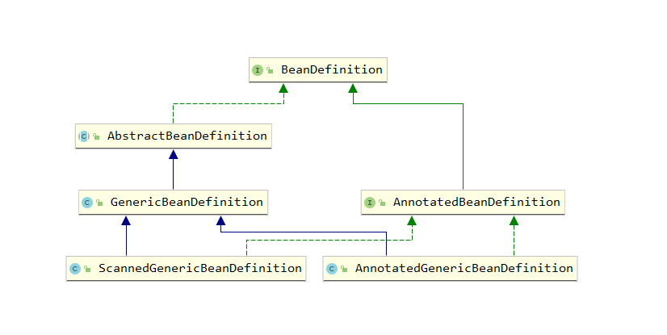
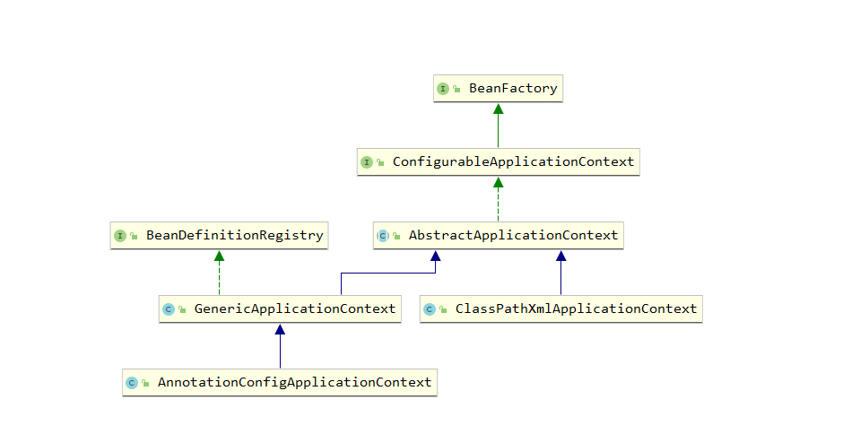

## BeanDefinition
```
在Spring的内部, 为了能够描述一个Bean对象, 会利用一个BeanDefinition的实现类来进行描述, 其里面的属性是对一个Bean对象的
完整描述, 可以将其理解为Class对象是对一个类的描述一样, 在BeanDefinition中, 会描述一个Bean对象的作用域, 角色, 是否是以
代理对象的方式返回给用户等信息, 还有该类对象的注解元信息等

继承体系如下图所示
```




## Spring的工厂和Spring的上下文
```
日常我们通过如下代码就能创建Spring的上下文:
    AnnotationConfigApplicationContext context = new AnnotationConfigApplicationContext( SpringConfig.class );

Spring的上下文里面会有一个工厂类对象, 我们的所有bean对象都是存放在该工厂对象中, 通常情况下我们的Spring工厂对象就是一个
DefaultListableBeanFactory对象, 在这个对象里面, 有一个个的map, 这些map就是我们Spring存放bean对象的核心容器, 从一定程
度上, 我们可以认为这些map就代表了Spring工厂, 那么这个工厂对象则存在于Spring的上下文环境中, 即我们上面的代码中的
AnnotationConfigApplicationContext, 下面是该类的继承体系中的很小一部分, 但是对于理解Bean的生命周期来说就已经足够了
```



## 其他知识点
- [BeanFactory&&FactoryBean](06_BeanFactory和FactoryBean.md)
 
- [@Import注解之ImportSelector](02_@Import注解之ImportSelector.md)

- [@Import注解之ImportBeanDefinitionRegistrar](03_@Import注解之ImportBeanDefinitionRegistrar.md)

## AnnotationConfigApplicationContext的构造方法
```java
// AnnotationConfigApplicationContext有如下构造方法
public AnnotationConfigApplicationContext() {
    this.reader = new AnnotatedBeanDefinitionReader(this);
    this.scanner = new ClassPathBeanDefinitionScanner(this);
}

reader: 用于将BeanDefinition放入到Spring的容器中即DefaultListableBeanFactory的beanDefinitionMap中, 同时会对这些
        BeanDefinition进行一些公共注解的处理
scanner: 用于实现通过类的全类名扫描出全部的类, 并将其变成BeanDefinition
```

## Spring的扩展点
```
<1> BeanFactoryPostProcessor
        典型的应用为ConfigurationClassPostProcessor: 判断配置类是否以CGLib的方式生成
<2> BeanDefinitionRegistryPostProcessor
        典型应用为ConfigurationClassPostProcessor: 配置类的后置处理器, 负责将配置类进行完整的解析
<3> ImportSelector
<4> ImportBeanDefinitionRegistrar
<5> BeanPostProcessor
```

## 关于什么是自定义的BeanFactoryPostProcessor
```
在Spring上下文创建的过程中, refresh方法的invokeBeanFactoryPostProcessors方法是用来调用BeanFactory的后置处理器, 其主要
分为以下几步:
    <1> 调用自定义的BeanDefinitionRegistryPostProcessor的后置处理方法
    <2> 调用Spring容器自带的BeanDefinitionRegistryPostProcessor的后置处理方法
    <3> 调用自定义的BeanFactoryPostProcessor的后置处理方法
    <4> 调用Spring容器自带的BeanFactoryPostProcessor的后置处理方法
    <5> 调用通过解析配置类时扫描出来的所有类中实现了BeanFactoryPostProcessor接口的类的后置处理方法

那么上面的自定义指的是在refresh方法调用之前, 通过Spring上下文对象的addBeanFactoryPostProcessor增加的后置处理器, 而不是
通过@Componet注解标注的后置处理器, 那么如何增加这个自定义的后置处理器呢? 这个需要我们主动去调用refresh方法才能实现, 在
调用之前也需要我们主动去调用register方法来注册配置类, 如下:

AnnotationConfigApplicationContext context = new AnnotationConfigApplicationContext();
context.register( SpringConfig.class );
context.addBeanFactoryPostProcessor( 自定义的后置处理器 );
context.refresh();
```

## Spring的配置类
```
在我们日常使用的时候, 我们会发现一个不带@Configuration注解的类也能成为配置类, 使得Spring能正常的运行, 那么这个注解真正的
作用是什么呢? 在Spring内部, 将配置类分为两种, 一种是Full配置类, 一种是Lite配置类, 顾名思义, 就是完整的配置类以及精简版本
的配置类, 而带@Configuration注解的则是完整的配置类, 存在以下注解的为Lite配置类:
    @Component
    @ComponentScan
    @Import
    @ImportResource
    @Bean(方法中带有该注解)

Spring在处理@Configuration注解标注的配置类的时候, 会利用CGLib动态代理机制来生成一个代理类, 而精简版本的则不会, 这一步
操作在ConfigurationClassPostProcessor中实现的BeanFactoryPostProcessor的postProcessBeanFactory方法中会实现
```
