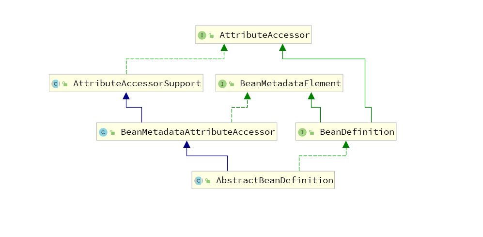
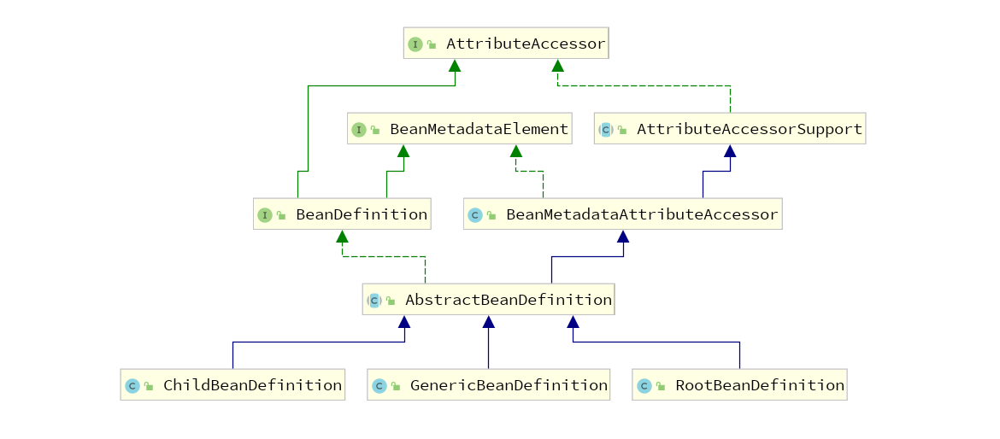

> BeanDefinition体系分析

### 引入
```
在Java中, 我们通过一个Class对象来描述一个类的信息, 比如方法、属性等信息, 在Spring中, 则是通过
BeanDefinition来描述一个Bean对象的, 比如这个对象的作用域(单例/多例), 本文将会从BeanDefinition的
顶层接口开始讲起, 指明每一个接口/类的作用, 从而能够从整体上看懂BeanDefinition的体系结构
```

### BeanMetadataElement
```java
public interface BeanMetadataElement {
	Object getSource();
}

分析: 该接口仅仅定义了一个getSource方法, 该方法用于返回一个source源, 其实就是返回一个Class文件在
      磁盘中的绝对路径而已, 在Spring中, BeanDefinition是间接的实现了这个接口的, 从而返回的是在
      BeanDefinition中定义的类的绝对路径
```

### AttributeAccessor
```java
public interface AttributeAccessor {
	void setAttribute(String name, @Nullable Object value);

	Object getAttribute(String name);

	Object removeAttribute(String name);

	boolean hasAttribute(String name);

	String[] attributeNames();
}

分析: 由名字可以知道, 这就是一个属性的访问接口, 提供了对属性的访问、设置功能, 同样的, BeanDefiniton
也是间接的实现了这个接口的, 之所以要实现这个接口是为了存储一些属性, 这些属性不应该放入到Bean的定义
中, 即为了实现类的单一职责, BeanDefinition仅仅用来定义bean对象的公共属性, 对于特殊的bean对象, 如
果还需要其它属性的定义, 那么就应该通过AttributeAccessor接口提供的功能来实现
```

### AttributeAccessorSupport
```java
public abstract class AttributeAccessorSupport implements AttributeAccessor {
	/** Map with String keys and Object values. */
	private final Map<String, Object> attributes = new LinkedHashMap<>();

	public void setAttribute(String name, @Nullable Object value) {
		if (value != null) {
			this.attributes.put(name, value);
		}
		else {
			removeAttribute(name);
		}
	}

	public Object getAttribute(String name) {
		return this.attributes.get(name);
	}

	public Object removeAttribute(String name) {
		return this.attributes.remove(name);
	}

	public boolean hasAttribute(String name) {
		return this.attributes.containsKey(name);
	}

	public String[] attributeNames() {
		return StringUtils.toStringArray(this.attributes.keySet());
	}
}

分析: 由上面的定义可以看到, AttributeAccessorSupport实现了AttributeAccessor接口, 并对其方法进行
了实现, 可以清晰的看到, 其就是通过一个map来存储我们所说的额外的属性的
```

> 那么如何对额外属性以及源数据进行整合的呢?即如何对BeanMetadataElement和AttributeAccessor整合呢

### BeanMetadataAttributeAccessor实现额外属性和源数据的整合
```java
public class BeanMetadataAttributeAccessor extends AttributeAccessorSupport implements BeanMetadataElement {
	private Object source;

	public void setSource(@Nullable Object source) {
		this.source = source;
	}

	public Object getSource() {
		return this.source;
	}

  .....
}

分析: BeanMetadataAttributeAccessor类通过继承AttributeAccessorSupport以及实现BeanMetadataElement
接口来对两个功能进行了整合, 这里用Object来描述一个Bean对象Class文件的绝对路径, 大家有兴趣可以在看
完整篇文章后调用该API看看效果
```

### 总结一
```
BeanMetadataAttributeAccessor继承AttributeAccessorSupport, 从而拥有了额外属性的功能, 即可以通
过调用父类的getAttribute和setAttribute来操作AttributeAccessorSupport中的map, 通过实现
BeanMetadataElement接口, 实现该接口的getSource方法来实现了可以存储class对象的源文件地址的功能
```

### BeanDefinition接口解析
```java
public interface BeanDefinition extends AttributeAccessor, BeanMetadataElement {
  // 两个常量, 方便在定义BeanDefinition的时候直接引用
	String SCOPE_SINGLETON = ConfigurableBeanFactory.SCOPE_SINGLETON;
	String SCOPE_PROTOTYPE = ConfigurableBeanFactory.SCOPE_PROTOTYPE;

  // 设置/获取父BeanDefinition, 下面会专门抽出来讲解这个
	void setParentName(@Nullable String parentName);
	String getParentName();

  // 设置Bean的类名, 之后在创建bean对象的时候就是创建这里定义的类名
	void setBeanClassName(@Nullable String beanClassName);
	String getBeanClassName();

  // 设置作用域, 单例/原型
	void setScope(@Nullable String scope);
	String getScope();

  // 设置是否延迟加载
	void setLazyInit(boolean lazyInit);
	boolean isLazyInit();

  // 设置是否依赖其它bean对象, 如果有依赖其它bean对象, 那么只有当其它bean对象被创建后才会创建当前
  // beanDefinition中定义的对象
	void setDependsOn(@Nullable String... dependsOn);
	String[] getDependsOn();

  // 设置是否允许当前bean对象被其它对象注入, 其是否允许其它对象通过@Autowired类似的方式注入
	void setAutowireCandidate(boolean autowireCandidate);
	boolean isAutowireCandidate();

  // 当出现一个类对象有多个实例在容器中时, @Autowired注入的时候是否以当前对象为主, 如果没设置
  // 则会报错, 错误信息就是发现在容器中有多个xxx类实例
	void setPrimary(boolean primary);
	boolean isPrimary();

	void setFactoryBeanName(@Nullable String factoryBeanName);
	String getFactoryBeanName();

  // 在xml配置的时候, 有如下配置<bean id="bean1" factory-method="test" class="com.A">,
  // 那么在容器中就会有一个BeanDefinition, id为bean1, FactoryMethodName为test, 由该BeanDefinition
  // 生成的bean对象是由com.A的test方法生成的
	void setFactoryMethodName(@Nullable String factoryMethodName);
	String getFactoryMethodName();

  // 等价于xml配置中bean标签的子标签constructor-args, 用来定义创建bean对象时的构造器, 在创建对象
  // 的时候, 会根据ConstructorArgumentValues的值来选择构造器,
	ConstructorArgumentValues getConstructorArgumentValues();
	default boolean hasConstructorArgumentValues() {
		return !getConstructorArgumentValues().isEmpty();
	}

  // 等价于xml配置中bean标签中的子标签property, 用来在创建bean对象的时候填充对象中的属性
	MutablePropertyValues getPropertyValues();
	void setInitMethodName(@Nullable String initMethodName);

  // 设置初始化方法
	String getInitMethodName();

  // 该beanDefinition中定义的类是否是抽象类, 如果该值为true, 则不会创建bean对象
	boolean isAbstract();

  ......
}

分析: BeanDefinition定义了一个通用的bean对象的大部分方法, 以及一些常量, 这些方法都会在其子类
AbstractBeanDefinition中实现, 同样的, 一些bean对象可能由额外的属性, 这些操作都在
BeanMetadataAttributeAccessor这个类中实现了, 接下来就是通过AbstractBeanDefinition来实现接口
BeanDefinition, 以及继承BeanMetadataAttributeAccessor类, 这样就能够将这些功能统一起来了, 下面
我们先来看看目前的一个类的UML图
```




### AbstractBeanDefinition及其直接子类分析
```java
AbstractBeanDefinition的主要功能就是实现BeanDefinition中的方法, 并在方法要求的常量上定义应该拥有
的属性, 比如scope属性, 在此基础上, 通过继承BeanMetadataAttributeAccessor类, 整合了上面我们所说
的额外属性以及获取源文件这样的功能

AbstractBeanDefinition仅仅只有三个直接的子类, 分别是:
RootBeanDefinition、ChildBeanDefinition、GenericBeanDefinition, 下面我们对这三个子类进行相关说明

在Spring2.5之前, 仅仅只有RootBeanDefinition、ChildBeanDefinition两个子类, 我们一般通过
RootBeanDefinition来定义一个Bean对象, 但是有时候会出现这么一种情况, 我们需要连续定义多个
beanDefinition, 即连续创建多个RootBeanDefinition, 这时可能会出现很多相同的定义, 如下:

RootBeanDefinition bd1 = new RootBeanDefinition();
bd1.setBeanClassName( "com.test1" );
bd1.setScope( "singleton" );
....

RootBeanDefinition bd2 = new RootBeanDefinition();
bd2.setBeanClassName( "com.test2" );
bd2.setScope( "singleton" );
....

RootBeanDefinition bd3 = new RootBeanDefinition();
bd3.setBeanClassName( "com.test3" );
bd3.setScope( "singleton" );
....


由上述定义可以看到, 假设我们需要同时定义很多个BeanDefinition, 可能会出现这些定义都会有相同的设置,
从而造成冗余, 于是Spring就开发出了一种伪继承模式, 通过parent属性来实现父子定义, 子类可以拥有父类
的定义从而不用再重复定义相同的属性了, 这就是ChildBeanDefinition和RootBeanDefinition的由来, 由此
可见, 我们可以将多个bean的公共部分放置在一个RootBeanDefinition中, 然后创建多个ChildBeandefinition,
并且指定parent为RootBeanDefinition即可, 如下:

RootBeanDefinition rootBeanDefinition = new RootBeanDefinition();
rootBeanDefinition.setScope( BeanDefinition.SCOPE_SINGLETON );
rootBeanDefinition.setLazyInit( false );
rootBeanDefinition.setAbstract( false ); // 设置为抽象的, 则在创建bean对象的时候不会被创建
context.registerBeanDefinition( "root", rootBeanDefinition );

ChildBeanDefinition childBeanDefinition1 = new ChildBeanDefinition( "root" );
childBeanDefinition1.setBeanClass( TestClass1.class );
context.registerBeanDefinition( "child1", childBeanDefinition1 );

ChildBeanDefinition childBeanDefinition2 = new ChildBeanDefinition( "root" );
childBeanDefinition2.setBeanClass( TestClass2.class );
context.registerBeanDefinition( "child2", childBeanDefinition2 );


总结: 通过上述的方式, 就可以将一些公共的设置给抽离出来了, 从而使得RootBeanDefinition既可以独立成
一个bean对象的定义, 也可以作为多个bean对象的父类, 而ChildBeanDefinition则可以指定parent为root来
共享公共的定义

在Spring2.5以后, Spring又定义了一个GenericBeanDefinition, 从而打破了原来RootBeanDefinition以及
ChildBeanDefinition的弊端, ChildBeanDefinition在创建时必须指定一个parent, 而RootBeanDefinition
的setParent方法是无效的(可以通过源码看到), 而新的GenericBeanDefinition却不存在这样的情况, 所以
GenericBeanDefinition也称为通用的BeanDefinition, 此时我们的BeanDefinition的UML图就变成了下面
这样了
```



### GenericBeanDefinition的子类
```java
GenericBeanDefinition作为通用的BeanDefinition, 打破了原来RootBeanDefinition和ChildBeanDefinition
的弊端, 成为了一个通用的BeanDefinition, 但是我们在使用Spring的时候可以知道, 在一个Bean对象是可以
定义一些注解的, 比如我们可以自定义一个@Test注解, 那么一个GenericBeanDefinition是没法存储下这些注
解的信息的, 于是为了能够存储注解信息, GenericBeanDefinition又衍生出了两个子类, 分别是:
AnnotatedGenericBeanDefinition、ScannedGenericBeanDefinition, 这两个子类的定义几乎是类似的,
只不过AnnotatedGenericBeanDefinition比ScannedGenericBeanDefinition多了一些定义而已, 如下:

public class ScannedGenericBeanDefinition extends GenericBeanDefinition implements AnnotatedBeanDefinition {
	private final AnnotationMetadata metadata;

	public ScannedGenericBeanDefinition(MetadataReader metadataReader) {
		this.metadata = metadataReader.getAnnotationMetadata();
		setBeanClassName(this.metadata.getClassName());
	}

	@Override
	public final AnnotationMetadata getMetadata() {
		return this.metadata;
	}

	@Override
	public MethodMetadata getFactoryMethodMetadata() {
		return null;
	}
}
```
